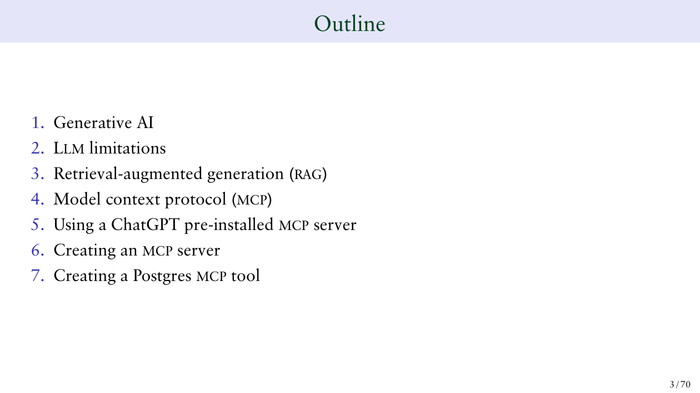
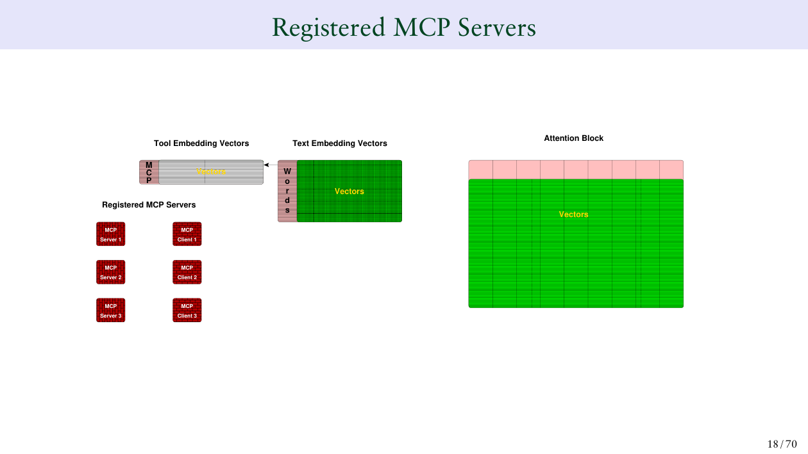
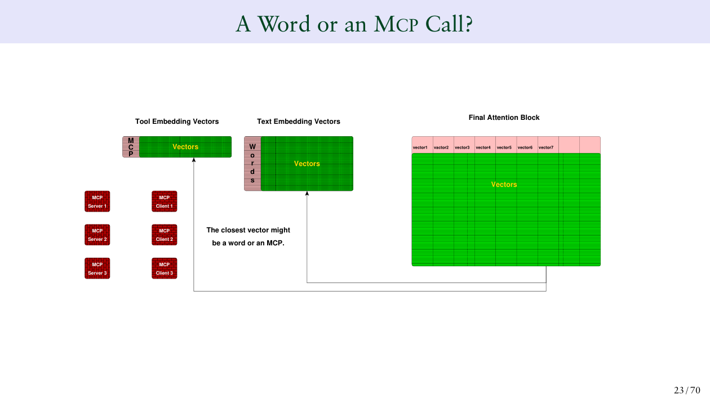
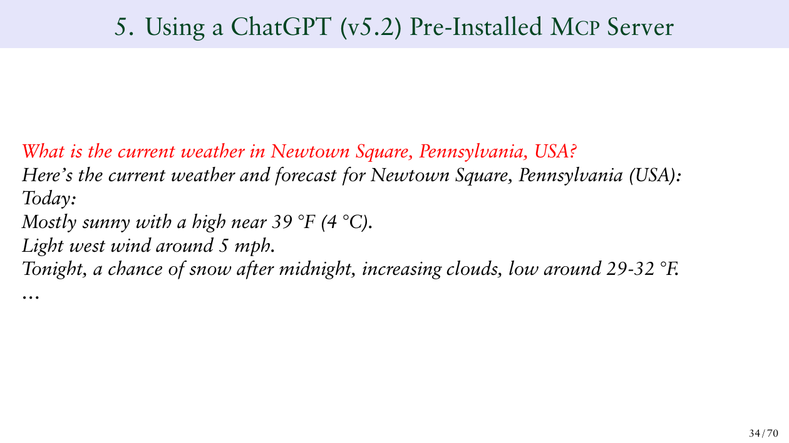
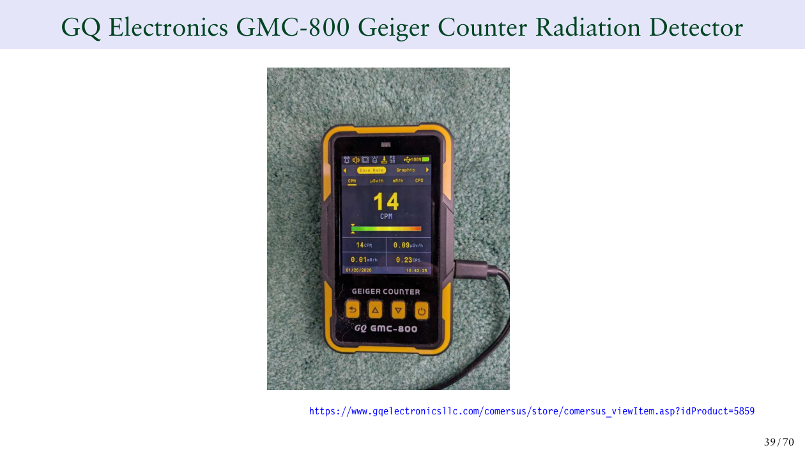

> 原文：[Building an MCP Server Using Postgres](https://momjian.us/main/writings/pgsql/mcp.pdf)，Bruce Momjian，PGDay Armenia 2026，CC BY 4.0。

> 本文AI率80%


Bruce Momjian（PG core team，写了 20 多年发行注记的那位）最近在 PGDay Armenia 2026 做了一个演讲：[Building an MCP Server Using Postgres](https://momjian.us/main/writings/pgsql/mcp.pdf)。70 页幻灯片，信息密度极高。有理论，有实践，是一个不错的借鉴。

直接读是比较费劲的，哪怕是直接让AI解读一下估计也不知道说的是什么，我也是看了一会问了几个问题后才算看明白了。

这 70 页可以清晰地切成两层——前半部分是理论教学，后半部分是实战 demo。两层之间，关系不大。

---

# 理论层：用 Transformer 解释 RAG → MCP 的演进（Slide 1-33）

理论层占了近一半篇幅，从 LLM 基本原理讲到 MCP 的工作方式。Outline 很清楚：



## RAG vs MCP：一句话说清

RAG 的流程大家都熟了：程序员决定查什么数据 → 检索结果拼到 system prompt → LLM 读完后生成回答。**预编排**——LLM 能看到什么，在用户提问之前就定好了。

MCP 不一样。工具描述注册给 LLM，LLM 在生成过程中**自己判断**要不要调工具、调哪个。**动态决策**——程序员只负责暴露工具，LLM 负责编排。

Bruce 用一句话总结：

> RAG 只能做程序员预设的事。MCP 可以根据输出质量动态调整，可以迭代调用多个工具，还可以触发外部任务。

## "是词还是 MCP"——那套向量嵌入图解

Slide 18-33 是理论层最核心的部分。Bruce 画了一套详细的 Transformer 内部流程图：



他的逻辑是：把每个 MCP tool 的描述文本（比如 "Return the radiation level (CPM) at 13 Roberts Road..."）用文本嵌入模型向量化，塞进 attention 层的向量空间里。然后在每一步推理时，output vector 去匹配最近似的向量——



> "The closest vector might be a word or an MCP."

## 这个模型对吗？

这是我最疑惑的地方，以下是我的浅见。

Bruce 这 15 页 slides 画得很好看，但如果当工程实现去理解，是有问题的：

**① MCP tool 不需要"嵌入"。** 实际工程中，tool 定义是作为文本直接写在 system prompt 里的。LLM 读到 "你有这些工具：geiger()、get_pretzel_inventory()..."，靠语义理解决定什么时候调。不需要把 tool 描述算成向量，不需要和词向量做余弦距离比较。Bruce 这套教学模型的本质是把"LLM 决策"解释成"向量最近似匹配"，这更像 retrieval 的范式而不是 generation 的范式。

**② Attention 不产出"查最近似"的操作。** `output = Σ(softmax(Q·K) × V)`，产出的是一个加权混合后的上下文向量。没有"在词向量表和 tool 向量表里二选一"这一步。LLM 选工具的实际机制是 attention 产出 hidden state → LM head → softmax over 词表 → 输出 tool call JSON。从来没有在"词和 tool 之间二选一"，只有在整个词表上做 softmax。

**③ system prompt 和 user prompt 在 attention 里没有边界。** Token 序列就是 token 序列，attention block 对所有 token 一视同仁做 Q·K 点积。不存在"system 区"和"user 区"。

所以这 33 页理论层，可以看作 Bruce 给非 AI 背景的 DBA 做的一个教学简化模型——好看、好懂，但别当架构图用。MCP 真正革命性的地方在**协议标准化**（统一的 tool 注册/发现/调用规范），不在向量化的 trick。

---

# 实践层：两个能跑的 demo（Slide 34-69）

从 Slide 34 开始，风格突变——全是代码、终端输出、硬件照片。理论层那套 Transformer 向量模型完全消失了，取而代之的是 `curl`、`psql`、Perl 脚本。

两层之间的唯一联系是"它们都在讲 MCP"，但理论层画的向量匹配机制和实战中的实现方式几乎是两套逻辑。 这可能正是 Bruce 演讲的张力所在——理论层让你理解 MCP 为什么比 RAG 强，实践层告诉你现在怎么落地。

## Demo 1：让 ChatGPT 读取真实世界的盖革计数器

Bruce 在自家院子里架了一台 GQ GMC-800 盖革计数器（测辐射的），USB 接树莓派，每 15 分钟测一次环境辐射。先看 ChatGPT 用 MCP 调用真实数据的效果：



MCP 可以调用外部工具获取实时数据——这是 RAG 做不到的。

接上硬件：



用 **fastmcp** 写了 Python wrapper：

```python
from fastmcp import FastMCP

mcp = FastMCP("Geiger counter MCP server")

@mcp.tool
def geiger() -> int:
    """Return the radiation level (CPM) at 13 Roberts Road, Newtown Square, PA, USA"""
    return subprocess.check_output(
        "/var/lib/postgresql/tmp/geiger", shell=True, text=True
    )
```

底层是一个 Perl 脚本，往串口发 `<GETCPM>>` 指令，读回 4 字节 CPM 值。Apache 做 443 端口反代（OpenAI 只跟 443 通信），注册到 ChatGPT 后：

```
User: 13 Roberts Road 的辐射水平是多少？
GPT:  我没有这个位置的公开数据……

User: 用我的 custom app
GPT:  [调用 geiger tool] → 14 CPM。正常环境背景辐射（5-25 CPM）。

User: 测五次，给我平均值
GPT:  [调用 ×5] 15 16 13 15 15 → 平均 14.8 CPM
```

两个关键行为：

1. **LLM 可以迭代调工具做计算**——RAG 是一次性塞数据，MCP 是"调 → 拿结果 → 判断 → 再调 → 算"
2. **用户必须显式授权**——第一次问的时候 ChatGPT 没说"我有你的盖革计数器数据"，直到说 "use my custom app" 才触发 tool call。安全模型很保守

## Demo 2：用 PG 做椒盐卷饼店的库存系统

从硬件回到软件。建一个椒盐卷饼（pretzel）库存库：

```sql
CREATE TABLE pretzel (
    quantity INTEGER CHECK (quantity >= 0)
);
INSERT INTO pretzel VALUES (0);  -- 初始库存 0
```

MCP tool 直接用 `psql` 操作 PG：

```python
@mcp.tool
def get_pretzel_inventory() -> int:
    """Return the number of unsold pretzels"""
    return subprocess.check_output(
        "psql --tuples-only -c 'SELECT quantity FROM pretzel;' -d mcp",
        shell=True, text=True
    )

@mcp.tool
def sold_one_pretzel() -> str:
    """Call this when a pretzel is sold; reduces inventory by one"""
    return subprocess.check_output(
        "psql --tuples-only -c 'UPDATE pretzel SET quantity = quantity - 1;' -d mcp",
        shell=True, text=True
    )

@mcp.tool
def baked_6_pretzels() -> str:
    """Call this when a tray of 6 pretzels is baked; increases inventory"""
    return subprocess.check_output(
        "psql --tuples-only -c 'UPDATE pretzel SET quantity = quantity + 6;' -d mcp",
        shell=True, text=True
    )
```

交互流程：

```
User: How many pretzels available?
GPT:  0 pretzels.

User: I just baked a tray        → 6 pretzels
User: I sold two                 → 4 remaining
User: I sold four                → 0 remaining

User: I sold one pretzel         → ERROR! CHECK constraint 阻止了 quantity 变负数
```

LLM 不直接写 SQL，而是调你预先定义的受控接口。PG 的 CHECK 约束天然构成了一个安全兜底——即使 LLM 被诱导调了不该调的函数，数据库层的约束还能挡一道。

但也暴露了问题：LLM 忠实执行了 `sold_one_pretzel`，但不会预判"库存已经是 0 了调了会报错"。**MCP 是执行层，不是推理层。**

---

# 生产还差多远

Bruce 在最后一页坦承了当前实现的局限：

- **没有认证**——谁都可以调你的 MCP Server
- **没有参数化**——三个 tool 都是无参函数，现实中的 tool 需要传参数
- **动态 SQL 没做安全限制**——工具描述声明了语义，但 LLM 可能被注入恶意内容
- **连接池、事务管理、频率限制**——一概没考虑

两篇值得读的实践经验：
- [pgedge.com: Lessons Learned Writing an MCP Server for PostgreSQL](https://www.pgedge.com/blog/lessons-learned-writing-an-mcp-server-for-postgresql)
- [CardinalOps: MCP Defaults — Hidden Dangers of Remote Deployment](https://cardinalops.com/blog/mcp-defaults-hidden-dangers-of-remote-deployment/)

---

# 两层之间

回头看这 70 页幻灯片，最有趣的不是任何一个 demo，而是MCP的理论思路和动手说明MCP能做什么：

1. 理论层用 Transformer 向量空间解释"LLM 如何在词和工具之间做选择"——这是教学模型
2. 实践层用 `psql`、`curl`、Perl 脚本去落地——这是工程实现

而真正的 MCP 机制——tool 定义当文本塞 system prompt、LLM 靠语义理解决定调哪个、输出 tool call JSON——应该是不需要理论层那套向量嵌入模型。两层之间，Bruce 没有画出来连接线。这可能不是 bug，是 feature。

