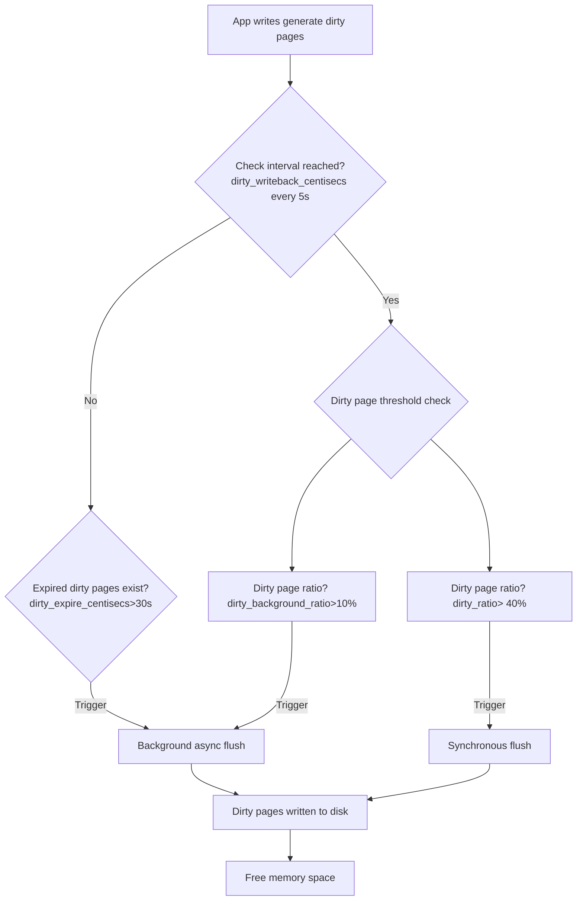
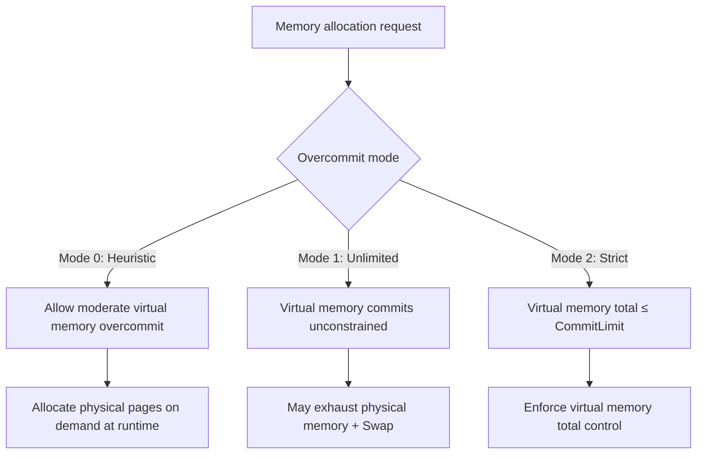

(For memory basics, refer to [Linux Memory Analysis](https://blog.csdn.net/qq_40687433/article/details/135492312?spm=1001.2014.3001.5501); this article covers memory knowledge above that foundation)

## Memory Basic Concepts

### buddy

The process of buddy system allocating and merging pages is omitted.

Easily overlooked knowledge points:

- The prerequisite for buddy merging two blocks of the same size is that their **physical addresses are contiguous**
- The merge algorithm is iterative: after merging at the current level, it will automatically attempt to merge larger blocks. This means compactd is not strictly required for merging

### page table & PTE

page table and PTE are actually two different concepts, and they are easily confused because both generally refer to page tables. Below is relevant knowledge about page table and PTE[^ 《深入理解Linux内核》 (Understanding the Linux Kernel)]

- PTE stores the physical address of the page frame
- "page table" and "Page Table" are different concepts: "page table" refers to the pages that maintain the mapping between linear addresses and physical addresses, while "Page Table" refers to pages in the upper-level page table
- pte_t, pmd_t, pud_t, pgd_t describe Page Table Entry, Page Middle Directory entry, Page Upper Directory entry, and Page Global Directory entry respectively
- PTE is Page Table Entry

If you only look at the size of the pagetable used by the MMU to cache virtual-to-physical memory mappings, confusing pagetable with PTE doesn't make much difference. However, if you need to go deep into page table directories, you need to separate the two concepts.

### TLB

Each level of the page table is stored in memory. To complete a single virtual-to-physical address translation, all four page tables corresponding to the current virtual address must be found. **This means a single memory IO requires looking up the page table in memory 4 times just for virtual-to-physical address translation**. Translation Lookaside Buffers (TLB) are caches specifically designed to accelerate virtual-to-physical address translation.

Regarding the TLB's location, it is usually in the L1 cache (some say it's in registers or L2, which likely depends on the CPU architecture; for now, just consider it as CPU cache, distinct from main memory)[^ Internminne og Cache,TLB L1]:


In modern processors, the L1 cache is typically divided into multiple parts, including data cache dTLB and instruction cache iTLB. Frequently modifying page tables leads to increased main memory accesses, causing the CPU to frequently flush the TLB cache[^ 《深入理解Linux内核》 (Understanding the Linux Kernel)]. The TLB also has a finite size; improving TLB hit rate can reduce accesses to the main memory pagetable. Using huge pages can reduce PTEs by three orders of magnitude, greatly reducing TLB misses.[^ 《深入理解Linux进程和内存》 (Understanding Linux Processes and Memory)].

TLB information:

```shell
#cpuid -l
   L1 TLB/cache information: 2M/4M pages & L1 TLB (0x80000005/eax):
   L1 TLB/cache information: 4K pages & L1 TLB (0x80000005/ebx):
...
   L2 TLB/cache information: 2M/4M pages & L2 TLB (0x80000006/eax):

```

Observing TLB hit rate:

```shell
perf stat -e dTLB-loads,dTLB-load-misses,iTLB-loads,iTLB-load-misses -I 10000 -p $PM_PID 
```

During memory reclamation, TLB misses do increase, but it's hard to establish a causal relationship. TLB miss is just one observation metric for the MMU — TLB is part of MMU.

### Reverse Mapping

The general principles of PFRA (Page Frame Reclaiming Algorithm)[^ 《深入理解Linux内核》 (Understanding the Linux Kernel)]:

1. First, release "harmless" pages. Start by reclaiming harmless pages in the pagecache — pages not occupied by any process
2. All pages of user-mode processes are candidates for reclamation. FRPA will gradually deprive user-mode pages with longer sleep times of their page frames
3. Cancel the mapping of all page table entries for a shared page frame, then reclaim that shared page frame
4. Only reclaim "unused" pages

One of PFRA's goals is to be able to release shared page frames. The process of quickly locating all page table entries pointing to the same page frame is called reverse mapping.

Reverse mappings for shared

- Anonymous pages
- File-mapping pages 

Basic tricks of page frame reclaiming

- LRU lists
- Free cheapest pages first
- Unmap all at once
- Etc[^ UNIVERSITY OF NORTH CAROLINA ,Page Frame Reclaiming]

### Huge Pages

Enabling huge pages provides certain performance improvements for specific application workloads. In PostgreSQL, enabling huge pages on large-memory instances also offers some performance gains and even some stability benefits.

Why are huge pages better?[^ kernel.org, Page Table Management]:

- Reduced TLB pressure
- Reduced pagetable size in main memory
- Huge pages are physically contiguous. Contiguous physical memory access is better than non-contiguous physical memory access
- When using these kinds of larger pages, higher level pages can directly map them, with no need to use lower level page entries[^ kernel.org,mm pagetables]

However, using huge pages brings management challenges:

- Huge pages need to be pre-allocated
- Huge page size must be calculated in advance to avoid memory waste

Two ways for processes to use huge pages:

- The first is by using `shmget()` to setup a shared region backed by huge pages
- the second is the call `mmap()` on a file opened in the huge page filesystem

### C Library and System Calls

The middle layer between kernel space and user space is the system call layer. Application Programming Interfaces (APIs) and system calls are different. Applications call APIs implemented in user space to program, rather than directly executing system calls. In the UNIX world, the most common system call layer is the POSIX standard (Portable Operation System Interface of UNIX). The POSIX standard targets APIs, not system calls. The Linux operating system's API is typically provided in the form of C standard libraries, such as libc. The C standard library provides implementations for most POSIX APIs.[^《奔跑吧 Linux内核 入门篇（第2版）》 (Running Linux Kernel: Beginner's Guide 2nd Edition)]

C app->C lib->system calls->OS->hardware[^ UNIVERSITY of WASHINGTON,PPT, POSIX I/O, System Calls]:


Common C library and system calls:

malloc,free=>C lib

mmap、brk、munmap=>system calls

### Page Fault Exception

Page fault exceptions (or page fault interrupts) need to distinguish two cases: exceptions caused by programming errors; and physical page allocation behavior triggered by using virtual address space where physical page frames haven't been allocated yet.[^ 《深入理解Linux内核》 (Understanding the Linux Kernel)]

- Exceptional page fault: Segment Fault — each virtual memory area has associated permissions. If a process accesses a memory area outside its valid range, or illegally accesses a memory area, or accesses a memory area in an incorrect manner, the processor reports a page fault exception. In severe cases, it reports a "Segment Fault" and terminates the process[^《奔跑吧 Linux内核 入门篇（第2版）》 (Running Linux Kernel: Beginner's Guide 2nd Edition)].

- Normal page fault: System calls like mmap and brk manage virtual memory; they don't directly allocate physical memory. Virtual memory system call functions only establish the process address space. Virtual memory is visible in user space, but no mapping between virtual memory and physical memory has been established. When a process accesses virtual memory where no mapping has been established, a page fault interrupt is triggered.[^《奔跑吧 Linux内核 入门篇（第2版）》 (Running Linux Kernel: Beginner's Guide 2nd Edition)]

Page faults are also divided into two types:

- minor fault: the page fault was handled without blocking the current process, and a page frame was allocated

- major fault: the page fault forced the current process to sleep (likely because filling the page frame with data from disk took time). A page fault that blocks the current process is a major fault[^ 《深入理解Linux内核》 (Understanding the Linux Kernel)]

### Copy-On-Write (COW)

When the fork system call is executed, the child process and parent process have independent process address spaces but share physical memory resources, including process context, process stack, memory information, file descriptors, directories, resource limits, etc. Only the parent process's page table needs to be copied to the child process. At this point, sharing is read-only. When writing is needed (when running their respective tasks), data is copied, giving the parent and child processes their own copies.[^《奔跑吧 Linux内核 入门篇（第2版）》 (Running Linux Kernel: Beginner's Guide 2nd Edition)]

For PostgreSQL's multi-process model, fork itself isn't heavy — you may only need to worry about page tables — but the various tasks that come after fork will trigger copy-on-write to create the child process's own resource copies.

**Note the distinction between copy-on-write and page fault exceptions: copy-on-write refers to resources not being allocated to the child process at fork time; page fault exceptions refer to physical memory allocation occurring for this process, unrelated to fork.**

### mmap, brk & Shared Memory Mapping Area, Heap Area

The functions and memory address regions used by mmap and brk are different:

- **`mmap` is used to manage shared memory, corresponding to the shared memory mapping area**
- **`brk` is used to manage private memory, corresponding to the heap area**

Linear address region functions:

- mmap: The mapping area expands top-down. The mmap mapping area and heap expand toward each other until they exhaust the remaining space in the virtual address space. This structure facilitates the C runtime library's use of the mmap mapping area and heap for memory allocation.
- Stack: Stores local variables and function parameters during program execution, grows from high addresses to low addresses
- Heap: Dynamic memory allocation area, managed through functions like malloc, new, free, and delete
- BSS (Uninitialized Variables): Stores uninitialized global variables and static variables
- Data: Stores global variables and static variables with predefined values in source code
- Text (Code): Stores read-only program execution code, i.e., machine instructions.

Shared memory mapping area and heap area[^ Linux可执行文件与进程的虚拟地址空间 (Linux executable files and process virtual address space)]:


Real postmaster heap and shared memory mapping:

```shell
cat /proc/1063005/smaps |grep -E "\-s|heap"
022a4000-022ee000 rw-p 00000000 00:00 0                                  [heap]
7fef6019e000-7fef601a5000 rw-s 00000000 00:17 21                         /dev/shm/PostgreSQL.1291978332
7fef601a5000-7fef6098b000 rw-s 00000000 00:01 1052                       /dev/zero (deleted) #this is shared buffers
7fef6e238000-7fef6e239000 rw-s 00000000 00:01 10                         /SYSV0011f702 (deleted)
```

You can see the heap and shared memory area addresses roughly match.

## VM

Linux kernel virtual memory subsystem

Directory: `cd /proc/sys/vm/`

### compact

#### concept & param

Memory compaction is a mechanism in the Linux kernel for solving memory fragmentation problems. It improves the allocation and compaction efficiency of large contiguous memory pages by merging free physical pages.

| Parameter                    | Function                                              | Default/Range                                                  |
| ----------------------------- | ----------------------------------------------------- | ------------------------------------------------------------ |
| `compact_memory`              | Manually trigger a global memory compaction operation | Write 1 to trigger                                           |
| `compaction_proactiveness`    | Controls the frequency of proactive compaction        | Parameter available since 4.x. 0-100 (default 20)            |
| `compact_unevictable_allowed` | Whether to allow compaction of unreclaimable pages (e.g., `mlock` locked memory) | Parameter available since 4.x. 0 (disable) or 1 (allow)      |
| `defrag_mode`                 | Controls the trigger strategy for memory defragmentation | Parameter available since 4.x. 0-3. 0 disables automatic compaction; 1 defers passive compaction. Default in 3.10 is 1 |
| `extfrag_threshold`           | Threshold for triggering compaction when large memory blocks are insufficient | 0-1000 (default 500)                                         |

There are 3 compaction modes (depending on kernel version support):

- Passive compaction: `extfrag_threshold` addresses "already occurred" fragmentation problems — triggered when a process requests large memory blocks and finds them insufficient.
- Proactive compaction: `compaction_proactiveness` proactively controls compaction aggressiveness, optimizing "not yet occurred" but potential fragmentation risks.
- Manual compaction: `compact_memory`.

`extfrag_threshold` is the Linux kernel parameter controlling passive compaction. When the kernel fails to allocate high-order contiguous physical memory (e.g., huge pages), it determines the failure cause via the fragmentation index:

- `-1`: Allocation succeeded (watermark satisfied)
- `0`: Failed due to insufficient memory
- `1000`: Failed due to fragmentation

View specific values via `/sys/kernel/debug/extfrag/extfrag_index`. The output is a floating-point number (e.g., `0.854`), but the actual range is magnified 1000x, so `0.854` corresponds to an actual value of 854:

```shell
cat /sys/kernel/debug/extfrag/extfrag_index |grep Normal
Node 0, zone   Normal -1.000 -1.000 -1.000 -1.000 -1.000 -1.000 -1.000 -1.000 -1.000 0.995 0.998 
```

If extfrag_threshold=600, compaction is triggered when the fragmentation index > 600. extfrag_index is quite useful and can assist buddy in observing fragmentation issues.

### dirty

#### concept & param

Dirty page flushing is somewhat similar to memory reclamation and is also divided into asynchronous and synchronous:

- Asynchronous flushing: performed by background threads like pdflush/flush/kdmflush; application writes are not affected
- Synchronous flushing: directly blocks the application process; the process that initiated the write operation flushes the dirty pages itself

| Parameter Name            | Description                                           | Default      |
| ------------------------- | ----------------------------------------------------- | ------------ |
| dirty_background_bytes    | Background async flush threshold, in bytes            | 0 (disabled) |
| dirty_background_ratio    | Background async flush threshold, as percentage       | 10%          |
| dirty_bytes               | Synchronous flush threshold, in bytes                 | 0 (disabled) |
| dirty_ratio               | Synchronous flush threshold, as percentage            | 20-40%       |
| dirty_expire_centisecs    | Maximum lifetime of dirty pages in memory             | 3000 (30s)   |
| dirty_writeback_centisecs | Frequency of kernel periodic dirty page state checks  | 500 (5s)     |

xxx_bytes and xxx_ratio parameters are mutually exclusive.

Example parameters and flowchart:

```shell
dirty_background_bytes 0
dirty_background_ratio 10
dirty_bytes 0
dirty_ratio 40
dirty_expire_centisecs 3000
dirty_writeback_centisecs 500
```



The configuration principles for dirty page flush parameters are basically the same as PostgreSQL dirty page flush parameters. Setting them too low causes overly frequent flushing — the same dirty page may be written to disk multiple times, wasting IO. Setting them too high may cause IO storms.

#### Observing Dirty Pages

Monitoring dirty pages:

```shell
ps -eo pid,%cpu,%mem,wchan,args,state|grep kdmflush|grep -E -w -v "S" #Observe async flush process state
cat /proc/vmstat| grep -E -w "nr_dirty|nr_writeback"  #vmstat dirty, page count
cat /proc/meminfo |grep -i dirty                      #meminfo dirty, KB
```

Testing dirty pages with dd:

```shell
 grep -E "nr_dirty_threshold|nr_dirty_background_threshold" /proc/vmstat | awk '{printf "%s: %.2fGB\n", $1, ($2*4)/1048576}'
nr_dirty_threshold: 141.28GB
nr_dirty_background_threshold: 35.32GB
```

```shell
dd if=/dev/zero of=testfile bs=8k count=128000               # cache io 
```

Failed test (same result after multiple tests):

- No RUNNING kdmflush process observed
- Dirty pages were flushed before reaching 35GB or 30S threshold

| Timestamp    | nr_dirty   | nr_dirty(GB) | Trend Simulation        |
| ------------ | ---------- | ------------ | ----------------------- |
| **17:00:18** | 2,757      | 0.01052      | ▍                       |
| 17:00:19     | 336,199    | 1.282        | ████▌                   |
| 17:00:25     | 1,984,867  | 7.574        | ██████████████▍         |
| **17:00:32** | 4,252,177  | **16.22**    | ████████████████████    |
| 17:00:33     | 3,699,227  | 14.11        | █████████████████▊      |
| 17:00:38     | 170,865    | 0.652        | ▎                       |
| 17:00:46     | 2,865,814  | 10.93        | █████████▋              |
| **17:00:54** | 4,721,827  | **18.01**    | ██████████████████████  |
| 17:00:55     | 3,876,509  | 14.79        | ██████████████████      |
| 17:01:03     | 835,097    | 3.186        | ██▊                     |

#### os dirty != pg dirty

With pg fsync=on, data writes go through the OS pagecache before specific blocks are written to disk. PostgreSQL has its own dirty pages, and the OS also has dirty pages. What's the relationship between the two?

```shell
## Observation commands
cat /proc/meminfo |grep -E -w "Dirty" # OS dirty pages

select isdirty,pinning_backends,count(*) from  pg_buffercache where isdirty is true group by isdirty,pinning_backends; # PG dirty pages
```

```sql
checkpoint;
begin;
--Observe
insert into tlzl select generate_series(1,1000000);
--Observe
commit;
--Observe
checkpoint;
--Observe
```

Test results:

| stage                    | dirty in pg | OS dirty                   |
| ------------------------ | ----------- | -------------------------- |
| Clean state              | 0           | 0.02-2M fluctuating        |
| After insert completion  | 200M        | Rose to 1.7G, then dropped to 20KB |
| After commit             | 200M        | 0.02-2M fluctuating        |
| After checkpoint flush   | 0           | 0.02-2M fluctuating        |

When the insert data size is increased, OS dirty rises during insert, rising to the GB level and then fluctuating.

PG dirty has some relation to OS dirty but they're not entirely correlated. When PG inserts data, OS dirty does rise, but after the OS flushes its own dirty pages, PG's dirty pages remain dirty. Preliminary judgment: dirty pages in shared memory are unrelated to OS dirty. It's yet to be determined whether the OS dirty increase comes from PG's private memory dirty pages.

### swappiness

Controls the kernel's bias toward reclaiming memory from the anonymous memory pool or the page cache. Essentially, it controls whether swapping anonymous pages or reclaiming file pages imposes a lower cost for the upper-layer application. For example, for compute-oriented applications using more dynamic allocation or private memory, a lower swappiness should be set; for data-dependent applications, a higher swappiness should be set to reduce the impact of flushing file pages on data access. However, all of this depends on the efficiency of swap IO and filesystem IO[^Configuring an operating system to optimize memory access]. It all sounds ideal, but when swapping occurs, it very likely means performance degradation.

#### swappiness=0

When `swappiness=0`, the kernel will only swap when memory reaches the high watermark[^linux kernel doc vm]. The specific strategy also relates to the kernel version and NUMA. What can be confirmed is that `swappiness=0` does not mean swap is disabled — `swapoff -a` is what disables the swap functionality.

```shell
#Check if swap is enabled
swapon --show
free -h |grep Swap
cat /proc/swaps
grep -E 'swap|none' /etc/fstab
cat /proc/meminfo|grep Swap

#Monitor whether swapping is occurring
cat /proc/vmstat|grep swp
sar -W 1
```

#### inconsistent swap behavior

The OS-level /proc/sys/vm/swappiness has little-to-no effect on the swap behavior of cgroups v1 systems (has little-to-no effect on the swap). This issue can lead to inconsistent swap behavior[^inconsistent swap behavior].

Occurrence conditions (all must be true):

- vm.swappiness != cgroups memory.swappiness
- cgroups v1

Cause:

systemd creates cgroups early during startup, before `sysctl.service` loads `/etc/sysctl.conf`. vm.swappiness cannot constrain cgroup memory.swappiness. The issue is: when the OS swap behavior and cgroup behavior differ, which one takes effect?

Solutions:

- for cgroup v1, set vm.swappiness = all cgroups memory.swappiness
- for cgroup v1, many solutions available, see https://access.redhat.com/solutions/6785021
- Use cgroup v2. v2 adds the vm.force_cgroup_v2_swappiness parameter, which disables cgroup's memory.swappiness

### memory overcommitment

#### concept & param

Linux does not reserve physical memory for every virtual address; instead, it allocates memory only when actually needed. Overcommitment can limit the total virtual memory size that all processes can request. When the requested memory exceeds the defined physical memory size, it's called overcommit.

There are three overcommit policy parameters: `overcommit_memory`, `overcommit_ratio`/`overcommit_kbytes`

The `overcommit_memory` parameter controls the overcommitment policy:

- `0` (default): Heuristic overcommitment policy, allows slight overcommit. CommitLimit = physical memory + swap.
- `1`: No overcommit check
- `2`: Strict limit, prohibits exceeding `CommitLimit`



When `overcommit_memory=2`, only one of the `overcommit_ratio` and `overcommit_kbytes` parameters takes effect. The `CommitLimit` is calculated as follows:
$$
CommitLimit = (RAM - huge page memory) × \frac{overcommit\_ratio}{100} + SwapTotal
$$
or
$$
CommitLimit = (RAM - huge page memory) + overcommit\_kbytes + SwapTotal
$$
Interesting overcommit accounting[^ overcommit accounting] — mmap, brk, fork are all accounted for, which clearly affects PostgreSQL:

```
Status
------
o	We account mmap memory mappings
o	We account mprotect changes in commit
o	We account mremap changes in size
o	We account brk
o	We account munmap
o	We report the commit status in /proc
o	Account and check on fork
o	Review stack handling/building on exec
o	SHMfs accounting
o	Implement actual limit enforcement
```

#### Reserve Memory and Overcommit

`user_reserve_kbytes`: When overcommit_memory=2, physical memory reserved for ordinary user processes. When system memory is severely insufficient, it ensures ordinary users can still perform basic operations (like starting new processes, handling memory allocation requests). Default is min(3% of the current process size, 128M). When set to 0, a single process can allocate (all free memory - admin_reserve_kbytes)

`admin_reserve_kbytes`: Physical memory reserved for users with `CAP_SYS_ADMIN` privileges (typically root user), ensuring admin recovery capability — reserved physical memory ensuring the system administrator can log in and execute commands. Default is min(3% memory, 8MB). When using strict overcommit mode, it's best to increase this parameter.

```shell
$ cat user_reserve_kbytes  
131072
$ cat admin_reserve_kbytes 
8192
```

#### Observing Overcommit

```shell
grep -E 'CommitLimit|Committed_AS' /proc/meminfo
sar -r 1
```

```shell
$ grep -E 'CommitLimit|Committed_AS' /proc/meminfo
CommitLimit:    203103492 kB
Committed_AS:   252170700 kB

$  sar -r 1
07:32:35 PM kbmemfree kbmemused  %memused kbbuffers  kbcached  kbcommit   %commit  kbactive   kbinact   kbdirty
07:32:37 PM  25472180 370249056     93.56     14588 274485956 252242936     62.91 233866528 103568816     12924
07:32:38 PM  25471904 370249332     93.56     14588 274487888 252242740     62.91 233851748 103570136     11180
```

Metric meanings:

- meminfo CommitLimit: CommitLimit calculated from physical memory, Swap, and overcommit parameters
- meminfo Committed_AS: Total virtual memory currently requested by all processes
- sar -r kbcommit = Committed_AS
- sar -r %commit = kbcommit / total physical memory

smaps or status can also show total requested virtual memory, but directly summing smaps/status total virtual memory double-counts shared library files and mapped files (like mmap), while `Committed_AS` only counts memory requested via mmap, brk, fork, etc., and does not double-count shared memory. The two have different calculation scopes. For total virtual memory, just look at Committed_AS or kbcommit.

### watermark

| Parameter Name         | Description                                                  | Introduced                | Default                          | Unit/Range               |
| ---------------------- | ------------------------------------------------------------ | ------------------------- | -------------------------------- | ------------------------ |
| min_free_kbytes        | Defines the minimum free memory the system reserves, directly affecting the watermarks `watermark[min]` calculation, ensuring the system retains enough memory for critical operations when memory is tight | Early kernel versions     |                                  | KB                       |
| watermark_scale_factor | Globally adjusts the memory watermark gap (`high-low` and `low-min`) | Linux kernel 4.x (exact minor version unknown) | `10` (0.1% physical memory)      | Max `3000` (30% physical memory) |
| watermark_boost_factor | Temporarily raises the high watermark (`high`), triggering aggressive memory reclamation to reduce fragmentation | Linux kernel 4.x (exact minor version unknown) | `15000` (i.e., 1.5x original high watermark) |                          |

#### min_free_kbytes

```shell
## Calculate total min and other values from zoneinfo
cat /proc/zoneinfo | grep -E -w "min|low|high"|grep -E -v "high:"| awk '
/min/ { total_min += $2 }
/low/ { total_low += $2 }
/high/ { total_high += $2 }
END {
  printf "Total min: %d KB\nTotal low: %d KB\nTotal high: %d KB\n",
        total_min * 4, total_low * 4, total_high * 4;
}'
Total min: 15828844 KB
Total low: 19786048 KB
Total high: 23743260 KB

#Current system min value
cat min_free_kbytes
15828849
```

Because there are other zones, the total min across all zones is approximately equal to min_free_kbytes. The Normal zone's min is definitely slightly smaller than min_free_kbytes; you only need to focus on the Normal zone:

```shell
## Normal zone min, low, high settings; page=4k
cat /proc/zoneinfo | grep -A 50 Normal | grep -E "min|low|high"
        min      3931615
        low      4914518
        high     5897422
```

Before Linux kernel 4.6, min, low, and high had a fixed ratio, and you could only change low and high values by setting min_free_kbytes. **min:low:high = 1:1.25:1.5**.

Problems with the fixed ratio:

Ideally, you'd want to raise low to more proactively trigger kswapd async reclamation and lower min to reduce direct reclaim. Before 4.6, you could only indirectly adjust low/high by adjusting min, using min to adjust kswapd's delta working buffer. For example:

|                                 | kswapd async reclamation working buffer (low-min) | kswapd async reclamation workload (high-low) |
| ------------------------------- | ------------------------------------------------- | -------------------------------------------- |
| min=1GB, low=1.25GB, high=1.5GB | 0.25GB                                            | 0.25GB                                       |
| min=10GB, low=12.5GB, high=15GB | 2.5GB                                             | 2.5GB                                        |

Raising min is done to raise low and high.

An excessively low min value causes kswapd to not have time to asynchronously reclaim more memory before direct reclaim triggers. An excessively high min not only wastes memory but also causes more frequent reclamation activity, resulting in higher sys CPU usage. The default difference between low and min in Linux indeed seems a bit small.

#### watermark_scale_factor

Wouldn't it be great if you could directly adjust min, low, and high? Sorry, the Linux kernel doesn't support that (Android has extra_free_kbytes). But...

Since Linux kernel 4.x, the watermark_scale_factor parameter was added, allowing adjustment of the ratios between parameters — the ratio is no longer fixed. Its default value is 10, corresponding to 0.1% of memory (10/10000), with a maximum of 3000. When set to 1000, it means the difference between "low" and "min", and between "high" and "low", will both be 10% of memory size (1000/10000).

0.1% is clearly too small — for 1TB of memory, the scale is only 1GB.

#### watermark_boost_factor

watermark_boost_factor is used to optimize external memory fragmentation. It temporarily raises the zone's watermark, i.e., zone->watermark_boost, thereby raising the zone's high watermark (WMARK_HIGH). This allows kswapd to reclaim more memory, making it easier for the memory compaction module (compactd kernel thread) to merge large blocks of contiguous physical memory. The default value of watermark_boost_factor is 15000, meaning the original high watermark is temporarily raised to 150%. Setting this to 0 disables the mechanism for temporarily raising zone watermarks[^CarlyleLiu's Blog Linux Memory Management (12) Memory Tuning]

### oom

The OOM Killer is a kernel module, not a process.

| Parameter Name           | Description                                                  | Default |
| ------------------------ | ------------------------------------------------------------ | ------- |
| panic_on_oom             | Controls system behavior when OOM occurs: **0: Don't trigger panic, start OOM Killer** 1: Trigger panic and halt 2: Trigger panic then attempt memory release | 0       |
| oom_kill_allocating_task | Whether to preferentially kill the process that triggered OOM (rather than traversing the process tree to select the optimal target): 0: Disabled 1: Enabled | 0       |
| oom_dump_tasks           | Whether to dump all task information when OOM occurs (for post-mortem analysis): 0: Disabled 1: Enabled | 1       |

#### oom_score

When OOM occurs, the system needs to decide which process to kill based on the OOM score. Each user process has 3 OOM score interface files:

```
-rw-r--r-- 1 postgres postgres 0 May 24 16:39 /proc/63766/oom_adj
-r--r--r-- 1 postgres postgres 0 May 24 16:39 /proc/63766/oom_score
-rw-r--r-- 1 postgres postgres 0 May 24 16:39 /proc/63766/oom_score_adj
```

oom_score is a dynamically calculated OOM score by the system, influenced at least by:

- Many child processes: +points
- Long-running: -points
- Low nice value: +points (nice value represents process CPU time slice priority. Lower nice values mean higher priority, more CPU time slice allocation)
- Direct hardware access: -points[^OOM-killer score]

In addition to the Linux-calculated OOM score, adjustments (adj) can be manually applied. oom_adj is from earlier Linux kernel versions; it's best to adjust OOM scores through the oom_score_adj interface file.

| Parameter/File  | Purpose                                    | Example Values                 |
| --------------- | ------------------------------------------ | ------------------------------ |
| oom_score       | Kernel-calculated raw score (dynamic)      | 0~1000                         |
| oom_score_adj   | User-defined adjustment value, directly affects final score | -1000~1000; -1000 equivalent to disabling OOM |
| oom_adj (legacy) | Legacy adjustment parameter, range -17~15 | -17~15                         |

### lowmem_reserve_ratio

Besides `min_free_kbytes`, there's another minimum memory reserve parameter that can cause process memory allocation failures, but their functions differ significantly.

`lowmem_reserve_ratio` is a key kernel parameter used to protect low-end memory (DMA, DMA32) from being excessively consumed by high-end memory allocation requests. lowmem_reserve_ratio is just a coefficient, not a directly usable number; the kernel calculates the reserved page count for each zone.

```shell
#Default values below
cat /proc/sys/vm/lowmem_reserve_ratio 
256     256     32
```

Memory zones are ordered by priority from low to high: DMA → DMA32 → Normal → HighMem. Allocation requests from higher-priority zones can "borrow" memory from lower-priority zones, but must reserve a certain proportion of memory for use by the lower-priority zones.

```shell
cat /proc/zoneinfo |grep -Ew "Node 0|protection|free"
Node 0, zone      DMA
  pages free     3976
        protection: (0, 2484, 386430, 386430)
Node 0, zone    DMA32
  pages free     415741
        protection: (0, 0, 383946, 383946)
Node 0, zone   Normal
  pages free     5658528
        protection: (0, 0, 0, 0)
```

For example, DMA's protection indicates:

- 0: Allocation from this zone, no cross-zone allocation restrictions
- 2484: Pages DMA reserves for DMA32 zone allocations
- 386430: Pages DMA reserves for Normal zone allocations
- 386430: Reserved extension field, meaningless in this context

Based on these settings:

- When DMA32 zone requests memory from DMA zone, 3976 > 2484, it may succeed
- When Normal zone requests memory from DMA zone, 3976 < 386430, it will not succeed
- Requests from lower zones to higher zones are not subject to this restriction

### misc

A few more related parameters; those with less relevance are not listed:

| Parameter                   | Purpose                                                      |
| --------------------------- | ------------------------------------------------------------ |
| nr_hugepages                | Number of huge pages                                         |
| ~~nr_overcommit_hugepages~~ | Overcommit of huge pages; The maximum is nr_hugepages + nr_overcommit_hugepages |
| ~~nr_hugepages_mempolicy~~  | NUMA-localized huge page allocation                          |
| ~~hugetlb_shm_group~~       | Shared memory permission control                             |
| ~~hugetlb_optimize_vmemmap~~| Restructure huge page metadata management model, reducing memory usage of huge page metadata (struct page). Supported since Linux kernel 5.13 |
| max_map_count               | Limits the maximum number of memory mapping regions (VMA) a single process can have, default 65530 |
| zone_reclaim_mode           | Memory reclamation policy under NUMA, e.g., allocating memory from other nodes |
| stat_interval               | VM stat refresh frequency, default 1 second                  |
| vfs_cache_pressure          | Parameter for VFS (Virtual File System) cache reclamation pressure, mainly affecting the aggressiveness of kernel reclaiming dentry and inode caches |
| page-cluster                | Swap readahead, swaps multiple pages to swap partition at once. Default 3, i.e., 8 pages at once |

## OS Memory Observation and Calculation

/proc/meminfo, /proc/vmstat, /proc/zoneinfo all contain memory information, much of it duplicative. I won't list the differences — a glance tells you what's what.

### free available Calculation (Unfinished)

General direction: (NR_FREE_PAGES + NR_FILE_PAGES - NR_SHMEM + NR_SWAP_PAGES + NR_SLBA_RECLAIMABLE - TOTALRESERVE_PAGES - root reserved memory)

The kernel has its own estimated available memory. Directly calculating the available value using a formula is difficult to get exactly right:

```shell
## Not very accurate, don't use
cat /proc/meminfo |grep -Ew "MemFree|Active\(file\)|Inactive\(file\)|SwapFree|SReclaimable|nr_shmem|Shmem"  |awk 'NR==1 {a=$2} NR==2 {b=$2} NR==3 {c=$2} NR==4 {d=$2} NR==5 {e=$2} NR==6 {f=$2 ;print (a+b+c+d-e+f)}' ;
cat /proc/meminfo |grep -Ew "MemAvailable";
```

### inactive_anon + active_anon != anon

Why?

- Primary: Shmem separately counts shared memory pages. nr_anon_pages does not include shared memory pages, while nr_inactive_anon and nr_active_anon include anonymous shared memory pages
- Secondary: anon includes some Unevictable pages (Mlocked is a subset of Unevictable)
- Other minor statistical differences have little impact

A rough but relatively accurate formula: nr_inactive_anon + nr_active_anon + nr_unevictable - nr_shmem

```shell
## Applicable under huge pages; not applicable under NUMA
## /proc/meminfo, /proc/zoneinfo, /proc/vmstat can all be used for calculation

#/proc/vmstat
echo -n "anon_computed        : ";cat /proc/vmstat|egrep -w "nr_inactive_anon|nr_active_anon|nr_unevictable|nr_shmem"| awk 'NR==1 {a=$2} NR==2 {b=$2} NR==3 {c=$2} NR==4 {d=$2; print (a+b+c-d)}' ;\
echo -n "anon_real            : ";cat /proc/vmstat|egrep -w "nr_anon_pages"|awk '{print $2}'
anon_computed        : 15776924
anon_real            : 15772671

##/proc/zoneinfo Normal
echo -n "anon_normal_computed        : "; cat /proc/zoneinfo |grep Normal -A 50|egrep -w "nr_inactive_anon|nr_active_anon|nr_unevictable|nr_shmem"| awk 'NR==1 {a=$2} NR==2 {b=$2} NR==3 {c=$2} NR==4 {d=$2; print (a+b+c-d)}' ;\
echo -n "anon_normal_real            : "; cat /proc/zoneinfo |grep Normal -A 50|egrep -w "nr_anon_pages"|awk '{print $2}'
anon_normal_computed        : 15711170
anon_normal_real            : 15707402
```

### cache Calculation

The buff/cache shown in the free command can be calculated from file pages or cache itself:

```shell
echo -n "filepage+shmem:  ";cat /proc/meminfo |grep -Ew "Buffers|Active\(file\)|Inactive\(file\)|Shmem|SReclaimable"| awk 'NR==1 {a=$2} NR==2 {b=$2} NR==3 {c=$2} NR==4 {d=$2} NR==5 {e=$2 ;print (a+b+c+d+e)}';\
echo -n "cached:          ";cat /proc/meminfo |grep -Ew "Buffers|Cached|SReclaimable" | awk 'NR==1 {a=$2} NR==2 {b=$2} NR==3 {c=$2 ;print (a+b+c)}';\
free -k;

#Execution results:
filepage+shmem:  289417584
cached:          289419156
              total        used        free      shared  buff/cache   available
Mem:      395721236    79633516    26668564    84704912   289419156   178501152
Swap:       5242876           0     5242876
```

### Controversy: Does shmem Count as cache?

Clearly, the calculation above includes shmem in cache. Theoretically, shmem shouldn't be part of cache.

In fact, the kernel community has discussed this[Why is Shmem included in Cached in /proc/meminfo?](https://lore.kernel.org/all/YS0Eq+tNe4Pr7O0X@casper.infradead.org/T/), wanting to remove shared memory from cache:

```c
> -	cached = global_node_page_state(NR_FILE_PAGES) -
> -			total_swapcache_pages() - i.bufferram;
> +	cached = global_node_page_state(NR_FILE_PAGES) -
> +			total_swapcache_pages()
> +			- i.bufferram - i.sharedram;
```

But modifying this involves forward compatibility concerns. The question comes down to: which is more important — forward compatibility or improving the accuracy of a piece of information?

Currently, there's no good resolution; that's the status quo.

The email thread also discusses some interesting things:

```
Another point of view is that everything in tmpfs is part of the page
cache and can be written out to swap
```

```
- Dirty: total amount of RAM used to buffer data to be written on
permanent storage (dirty). Gets converted to Cached when write is
complete. (Actually I would call this "Buffers" but Dirty is okay, too.)
- Cached: total amount of RAM used to improve *performance* that can be
*immediately dropped* without any data-loss – note that this includes
all untouched RAM backed by swap.
- Shared: total amount of RAM shared between multiple process that
cannot be freed even if any single process gets killed. (If this is even
possible to know - note that this would *only* contain COW pages in
practice. We already have Committed_AS which is about as good for real
world heuristics.)
```

- cache does not include dirty pages, and can be directly dropped without data loss
- tmpfs is swapout

Shared memory appears to be swapout, which is clearly different from cache pages that can be directly dropped. PostgreSQL's shared memory clearly cannot be directly dropped.

So for PostgreSQL, the fact that cache contains shared memory is quite important — don't assume by default that it doesn't.

### Memory Page Statistics Often Don't Add Up

When calculating memory pages, some calculations don't add up. Summary of reasons:

- shmem is counted in cache
- Cannot see file-mapped and anonymous-mapped pages within shmem
- nr_anon_pages does not include shared memory pages, while nr_inactive_anon and nr_active_anon include anonymous shared memory pages
- VM and cgroup have slightly different statistical scopes

## cgroup v1

### cgroup Memory Management

cgroup can observe and limit the usage of anonymous pages, file pages, swap cache, and kernel memory. Each memcg has its own independent LRU; there is no concept of a GLOBAL LRU.

cgroup memory management differs from cgroup CPU management. A task can request lots of CPU work; reaching the cgroup CPU limit can extend execution time to handle it. However, the memory a task occupies is working memory — a task uses the same physical memory.

Key differences between cgroup CPU and memory management:

- Memory must be managed through reuse and reclamation; a task's working memory is truly occupied and cannot be used by other tasks. CPU is managed through time allocation; other tasks or cgroups can use it.
- Memory needs to be instantly available; CPU works through time slicing — time can be dispersed.
- CPU control's core is time allocation; Memory Control's core is page counting.

> The core of the design is a counter called the page_counter. The
> page_counter tracks the current memory usage and limit of the group of
> processes associated with the controller

Memory Control's core is page counting, meaning it's not that physical pages are statically assigned. The memory allocated this time, when released back to free after use, most likely won't be the same physical page next time[^ kernel.org,cgroup v1].

Physical pages know which cgroup they belong to:

```shell
				+--------------------+
				|  mem_cgroup        |
				|  (page_counter)    |
				+--------------------+
				 /            ^      \
				/             |       \
           +---------------+  |        +---------------+
           | mm_struct     |  |....    | mm_struct     |
           |               |  |        |               |
           +---------------+  |        +---------------+
                              |
                              + --------------+
                                              |
           +---------------+           +------+--------+
           | page          +---------->  page_cgroup|
           |               |           |               |
           +---------------+           +---------------+
```

mm_struct represents virtual memory. Each virtual memory knows which cgroup it belongs to; each physical page can point to page_cgroup, meaning it knows which cgroup this physical memory belongs to[^ kernel.org,cgroup v1].

### cgroup Parameters and Metrics

cgroup uses interface files for configuration and viewing memory usage.

Directory: `cd /sys/fs/cgroup/memory/xxx/`

Kernel memory and mem+swap can have separate settings or usage viewing:

```
memory.kmem.xxx  #kernel mem
memory.memsw.xxx  #mem+swap
```

Below, we only look at mem-related items.

Interface files can be divided into three categories:

- Read-only — show usage, permissions: `-r--r--r--`
- Read-write — control parameters, permissions: `-rw-r--r--`
- Other — special settings, permissions: other

Specific meanings are as follows, with important parameters highlighted:

| Type | Interface File                  | Meaning                                                      |
| ---- | ------------------------------- | ------------------------------------------------------------ |
| Read-only | `memory.numa_stat`          | NUMA-dimensional memory stats                                |
| Read-only | **`memory.stat`**           | **Important**, the primary memory usage interface file with many metrics; analyzed separately below |
| Read-only | `memory.usage_in_bytes`     | usage_in_bytes is affected by the method and doesn't show 'exact' value of memory. Not recommended for viewing cgroup memory usage |
| Read-only | **`memory.failcnt`**        | Number of times memory usage exceeded `memory.limit_in_bytes`, cumulative |
| Read-write | `cgroup.clone_children`     | Controls whether child cgroups inherit parent configuration  |
| Read-write | **`cgroup.procs`**          | Used to manage process groups (process IDs, PIDs) in the current cgroup. **For multi-process PostgreSQL, this means writing all PG processes, including management processes and backends, into the `procs` file** |
| Read-write | `tasks`                     | Used to manage threads (thread IDs, TIDs) in the current cgroup. When writing a process PID to `cgroup.procs`, all its thread TIDs are automatically added to `tasks` |
| Read-write | `notify_on_release`         | Controls whether a release operation is triggered when the last task (process or thread) in the cgroup exits. Would only be enabled for container management; traditional cgroup management keeps it disabled by default. Cgroups should be preserved after database restart |
| Read-write | memory.move_charge_at_immigrate | Deprecated in v2. Charge attribution rules when migrating cgroups |
| Read-write | memory.use_hierarchy        | Whether parent cgroup limits child cgroups                   |
| Read-write | **memory.limit_in_bytes**   | **cgroup memory upper limit**                                |
| Read-write | **memory.soft_limit_in_bytes** | **Reclaim the portion exceeding the soft limit**           |
| Read-write | memory.max_usage_in_bytes   | cgroup usage peak, an observation metric                     |
| Read-write | **memory.oom_control**      | oom_kill_disable 1 — disable OOM<br>under_oom 0 — whether currently in OOM state |
| Read-write | **memory.swappiness**       | cgroup-level swappiness                                      |
| Other | memory.force_empty              | Write only; writing `0` forces release of all cgroup memory  |
| Other | cgroup.event_control            | Event notification interface, listens for memory pressure events, requires programming. Often used with memory.pressure_level |
| Other | memory.pressure_level           | Memory pressure notification level                           |

Using a PG instance to explain the meaning of various metrics in memory.stat.

This PG instance is configured as:

```shell
shared_memory_type=mmap
shared_buffers=64GB
approximately 800 clients, running
```

```shell
cat memory.stat

cache 345587761152 						      #page cache!!!
rss 27332608                                  #Anonymous and swap cache memory size. Note: differs from OS process RSS; clearly doesn't include PG shared memory
rss_huge 0                                    #of bytes of anonymous transparent hugepages. Note: anonymous huge pages
mapped_file 61491769344                       #File shared memory size; includes PG shared memory here
swap 0                                        #On swap partition
pgpgin 389395357                              #rss+cache charged pages
pgpgout 305016672                             #rss+cache uncharged pages
pgfault 1954040341                            #Omitted
pgmajfault 17                                 #Omitted
inactive_anon 165728256                       #anonymous and swap cache memory on inactive LRU
active_anon 61549518848                       #anonymous and swap cache memory on active LRU list
inactive_file 138240962560                    #file-backed on inactive LRU list
active_file 145658613760                      #file-backed memory on active LRU list
unevictable 0                                 #Unreclaimable memory
hierarchical_memory_limit 408021893120        #
hierarchical_memsw_limit 9223372036854771712  #
total_xxx                                     #hierarchical 
```

Roughly (ignoring swap), cache+rss = inactive_anon+active_anon+inactive_file+active_file.

These values are quite convoluted. cache+rss doesn't have a straightforward correspondence with [in]active_anon/file, and mapped_file (shared memory) is hard to categorize, making it easy to get confused. Combining various documentation and testing, I hand-rolled the following script:

```shell
#cginfo_lzl
echo -n "shared_mem_mapped         : ";cat /sys/fs/cgroup/memory/$PGNAME/memory.stat|egrep -w "mapped_file"| awk '{print $2 / 1024 / 1024 /1024 }' ;\
echo -n "shared_mem_anon           : ";cat /sys/fs/cgroup/memory/$PGNAME/memory.stat|egrep -w "rss|inactive_anon|active_anon"| awk 'NR==1 {a=$2} NR==2 {b=$2} NR==3 {c=$2; print (b + c -a)/1024/1024/1024}' ;\
echo -n "pagecache                 : ";cat /sys/fs/cgroup/memory/$PGNAME/memory.stat|egrep -w "cache"| awk '{print $2 / 1024 / 1024 /1024 }' ;\
echo -n "pagecache_cache-share     : ";cat /sys/fs/cgroup/memory/$PGNAME/memory.stat|egrep -w "cache|mapped_file"| awk 'NR==1 {a=$2} NR==2 {b=$2; print (a - b)/1024/1024/1024}';\\n
echo -n "file_total                : ";cat /sys/fs/cgroup/memory/$PGNAME/memory.stat|egrep -w "inactive_file|active_file"| awk '{sum += $2} END {print sum /1024/1024/1024}';\\
echo -n "anon_total                : ";cat /sys/fs/cgroup/memory/$PGNAME/memory.stat|egrep -w "inactive_anon|active_anon"| awk '{sum += $2} END {print sum /1024/1024/1024}';\\
echo -n "total_used_rss+map        : ";cat /sys/fs/cgroup/memory/$PGNAME/memory.stat|egrep -w "rss|mapped_file"| awk '{sum += $2} END {print sum /1024/1024/1024}';\\
echo -n "total_mem_file+rss+map    : ";cat /sys/fs/cgroup/memory/$PGNAME/memory.stat|egrep -w "inactive_file|active_file|rss|mapped_file"| awk '{sum += $2} END {print sum /1024/1024/1024}';\\
echo -n "total_mem_rss+cache       : ";cat /sys/fs/cgroup/memory/$PGNAME/memory.stat|egrep -w "rss|cache"| awk '{sum += $2} END {print sum /1024/1024/1024}';\\
echo -n "total_mem_anon+file       : ";cat /sys/fs/cgroup/memory/$PGNAME/memory.stat|egrep -w "inactive_file|active_file|inactive_anon|active_anon"| awk '{sum += $2} END {print sum /1024/1024/1024}';\\
echo -n "total_memsw               : ";cat /sys/fs/cgroup/memory/$PGNAME/memory.stat|egrep -w "rss|cache|swap"| awk '{sum += $2} END {print sum /1024/1024/1024}';\\
echo -n "hard_limit                : ";cat /sys/fs/cgroup/memory/$PGNAME/memory.limit_in_bytes| awk '{print $1 / 1024 / 1024 /1024 }'
```

```shell
#Database with shared_buffers=2GB
shared_mem_mapped         : 1.69063
shared_mem_anon           : 1.69828
pagecache                 : 5.94717
pagecache_cache-share     : 4.25654
file_cache                : 4.24889
anon_cache                : 3.23096
total_used_rss+map        : 3.2233
total_mem_file+rss+map    : 7.47219
total_mem_rss+cache       : 7.47984
total_mem_anon+file       : 7.47984
total_memsw               : 7.47984
hard_limit                : 8
```

### Differences Between cgroup RSS and Process RSS

```shell
#shared_buffers= 64GB, all PG process RSS sorted
ps -eo pid,ppid,rss,args |grep `cat $PGDATA/postmaster.pid|head -1`|sort -k3 -rn
 97632  97627 61103720 postgres: lzlinst: checkpointer   
 97633  97627 59045152 postgres: lzlinst: background writer   
 97627      1 2322820 /paic/postgres/base/11.3/bin/postgres -D /paic/pg6888/data
 97637  97627 85116 postgres: lzlinst: pgsentinel   
 97697  97627 19620 postgres: lzlinst: dbmgr users [local] idle
 97634  97627 17932 postgres: lzlinst: walwriter   
250063  97627 14508 postgres: lzlinst: dbmon postgres [local] idle
 97636  97627 13220 postgres: lzlinst: stats collector   
248777  97627 11576 postgres: lzlinst: dbmon postgres [local] idle
 97635  97627  2980 postgres: lzlinst: autovacuum launcher   
 97638  97627  2376 postgres: lzlinst: logical replication launcher   
 97630  97627  1592 postgres: lzlinst: logger   
250185  39130   972 grep --color=auto 97627
```

Generally, the PG processes with the highest RSS values are checkpointer and bgwriter, because RSS represents actual memory used, including shared memory, and these two processes that flush shared buffer dirty pages occupy the most. Backends with excessive data queries may also have higher RSS values, but this is usually caused by data extracts or slow full-scan queries.

Why is postmaster's RSS so small? Because postmaster itself doesn't need to do much shared_buffer operations; it only needs to open up the shared memory virtual address space and fork it for other processes to use.

PM's child processes have the same shared memory address but not necessarily the same RSS:

```shell
$ cat /proc/97632/smaps |grep -A 3 "zero" #checkpointer
2b4fd87cf000-2b60a2143000 rw-s 00000000 00:04 15925397                   /dev/zero (deleted)
Size:           70411728 kB
Rss:            61087812 kB
Pss:            31429895 kB
$ cat /proc/97633/smaps |grep -A 3 "zero" #bgwriter
2b4fd87cf000-2b60a2143000 rw-s 00000000 00:04 15925397                   /dev/zero (deleted)
Size:           70411728 kB
Rss:            59043388 kB
Pss:            29394787 kB
$ cat /proc/97627/smaps |grep -A 3 "zero" #postmaster
2b4fd87cf000-2b60a2143000 rw-s 00000000 00:04 15925397                   /dev/zero (deleted)
Size:           70411728 kB
Rss:             2318408 kB
Pss:             1741764 kB
```

Above, checkpointer and bgwriter occupy the most RSS, and most of their RSS is shared memory. These two processes almost evenly split the entire actually-used shared memory, while postmaster doesn't use much. PM and all its forked child processes have the same shared memory virtual address.

But cgroup RSS is only a few tens of MB, far less than process RSS:

```shell
cat /sys/fs/cgroup/memory/lzlinst/memory.stat |egrep -w "rss|mapped_file"
rss 88997888
mapped_file 52963262464
```

You can see that PG shared memory is not in the cgroup stat RSS. cgroup RSS doesn't count file pages or shared file pages.

linux kernel[^ kernel.org,cgroup v1]:

> Only anonymous and swap cache memory is listed as part of 'rss' stat. This should not be confused with the true 'resident set size' or the amount of physical memory used by the cgroup.

Process vs. cgroup memory statistics differences[^ Linux中进程内存及cgroup内存统计差异 (Linux process memory and cgroup memory statistics differences)]:

| Memory        | Single Process                    | Process `cgroup(memcg)` |
| :------------ | :-------------------------------- | :---------------------- |
| `cache`       | None                              | `PageCache`             |
| `mapped_file` | None                              | `file_rss + shmem_rss`  |
| `RSS`         | `anon_rss + file_rss ＋ shmem_rss`| `anon_rss`              |

For PostgreSQL, the RSS in stat does not include file map shared memory. The PG official documentation describes mmap as anonymous shared memory:

> Possible values are `mmap` (for anonymous shared memory allocated using `mmap`), `sysv` (for System V shared memory allocated via `shmget`) 

cgroup counts PG mmap memory as mapped_file.

Observing sysv and huge page scenarios, summary of PG's memory.stat metrics:

- RSS in stat does not include file map shared memory. Observation shows that regardless of mmap or sysv, RSS does not contain PG shared memory
- Similarly, rss_huge also does not include file map shared huge page memory. Observation shows that even with huge pages enabled, stat does not contain PG shared memory
- Without huge pages, PG shared memory (mmap or sysv) is all counted under memory.stat mapped_file; with huge pages, it's in none of the stat metrics, including rss_huge

### Where Exactly Is mapped_file?


- **mapped_file is in cache, and also in inactive_anon+active_anon**
- **mapped_file can also be anonymous; both mmap and sysv are counted here**

```shell
#Database with shared_buffers=2GB
shared_mem_mapped         : 1.69063
shared_mem_anon           : 1.69828
pagecache                 : 5.94717
pagecache_cache-share     : 4.25654
file_cache                : 4.24889
anon_cache                : 3.23096
total_used_rss+map        : 3.2233
total_mem_file+rss+map    : 7.47219
total_mem_rss+cache       : 7.47984
total_mem_anon+file       : 7.47984
total_memsw               : 7.47984
hard_limit                : 8
```

### soft_limit_in_bytes

Soft limit (`memory.soft_limit_in_bytes`) is a non-enforced constraint in cgroup memory management. When a cgroup's memory usage exceeds the soft limit, the system does not immediately force memory reclamation. Instead, it will **preferentially reclaim the excess memory** of that cgroup **when global memory pressure is high** (e.g., when overall system free memory is insufficient).

1. **Trigger condition**: Global memory pressure (e.g., insufficient system free memory).
2. **Call path**: `kswapd` → `balance_pgdat` → check cgroup soft limits → trigger reclamation.
3. **Reclamation target**: Preferentially reclaim memory pages from cgroups exceeding their soft limits.

```
+-------------------+    Global memory pressure detection    +-------------------+
|    kswapd thread   | ------------------------------------> |   balance_pgdat   |
+-------------------+                                        +-------------------+
                                                                 |
                                                                 | Traverse memory zones and check
                                                                 v
                                                     +---------------------------+
                                                     | Check each cgroup's soft   |
                                                     | limit usage                |
                                                     +---------------------------+
                                                                 |
                                                                 | Trigger reclamation for over-limit cgroups
                                                                 v
                                                     +---------------------------+
                                                     | Page reclamation (LRU list |
                                                     | scanning, etc.)           |
                                                     +---------------------------+

```

The soft_limit_in_bytes mechanism is very similar to high. In v2, soft_limit_in_bytes has been deprecated, replaced by three new parameters: min, low, and high.

### Impact of Overselling on pagecache

To be discussed later

### cg oom

Normally, if sharedbuffer = 1/4 of cg mem, then without counting private memory, pagecache can reach up to 3/4 of cg mem. Generally, normal business private memory usage won't be very high. If cg mem is full, memory can be reclaimed from cg pagecache (this is direct memory reclamation; AliOS has implemented async background reclamation: [Memcg Background Async Reclamation](https://help.aliyun.com/zh/alinux/user-guide/memcg-backend-asynchronous-reclaim?spm=a2c4g.11186623.0.0.562f42bammLZmK)). So the best way to test cg oom is to use sessions that consume lots of private memory rather than stress testing.

Test case:

```shell
#Observe score
-r--r--r-- 1 postgres postgres 0 May 24 16:39 /proc/63766/oom_score
rss # whichever command you like

## A SQL that can consume lots of private memory, many union alls create many plan nodes
psql -d lzldb -tX -c "create table lzl1(col1 varchar(1));"
psql -tX -c "\o sqltext.sql" -c "
SELECT 'select col1 from lzl1' || ' union all'
FROM generate_series(1, 100000)
UNION ALL
SELECT 'select col1 from lzl1;'
FROM generate_series(1, 1);
" 

#Adjust stack parameter otherwise SQL will be aborted
psql -d lzldb -c "set max_stack_depth=1024000" -f sqltext.sql
```

cg oom off:

wchan shows OOM information, even an oom score, but the process won't be killed by the OOM killer

```shell
## vm oom enabled; 0: don't trigger panic, start OOM Killer
$ cat /proc/sys/vm/panic_on_oom 
0

## cg oom disabled; 1: disable oom
$ cat  /sys/fs/cgroup/memory/$PGNAME/memory.oom_control
oom_kill_disable 1
under_oom 0

$ ps -eo user,ppid,pid,state,%cpu,%mem,stime,wchan:14,args,rss,vsz,sig_block |grep `head -1 $PGDATA/postmaster.pid` |grep -v grep 
postgres  19005    870 D  0.0  0.0 10:54 mem_cgroup_oom postgres: pg3ymhp2: lzluser  7216 2807460 0000000000000000
postgres  19005   3417 S  0.0  0.0 10:55 pipe_wait      postgres: pg3ymhp2: lzluser 22944 2808540 0000000000000000
postgres  19005  13069 D  0.0  0.0 11:10 mem_cgroup_oom postgres: pg3ymhp2: lzluser 11944 2808348 0000000000000000
postgres  19005  13104 D  0.0  0.0 11:10 mem_cgroup_oom postgres: pg3ymhp2: lzluser 12224 2808348 0000000000000000
postgres  19005  14352 D  0.0  0.0 11:10 mem_cgroup_oom postgres: pg3ymhp2: lzluser 11680 2808348 0000000000000000

cat  /sys/fs/cgroup/memory/$PGNAME/memory.oom_control
oom_kill_disable 1
under_oom 1

cat /proc/97994/oom_score
11

shared_mem_mapped         : 2.00019
shared_mem_anon           : 2.0023
pagecache                 : 2.0023
pagecache_cache-share     : 0.00211334
file_cache                : 0
anon_cache                : 8
total_used_rss+map        : 7.99789
total_mem_file+rss+map    : 7.99789
total_mem_rss+cache       : 8
total_mem_anon+file       : 8
total_memsw               : 8
hard_limit                : 8
```

Currently, it appears that PG processes may also crash when unable to allocate memory. For example, if walwriter crashes, it can cause all other processes to crash.

cg oom on:

User processes are killed due to high OOM score, sent kill -9. Most PG processes crash; postmaster `reset_shared()` then automatically restarts other processes. Both message and dmesg show out-of-memory information:

```shell
#cg oom enabled
oom_kill_disable 0

pg log:
2025-05-29 19:10:45.945 CST,,,198877,,6838374d.308dd,4,,2025-05-29 18:30:37 CST,,0,LOG,00000,"server process (PID 236413) was terminated by signal 9: Killed","Failed process was running: select col1 from lzl1 union all

message:
May 29 19:10:45 lzlhost kernel: Memory cgroup stats for /t1lzldb: cache:8392988KB rss:8384228KB rss_huge:0KB mapped_file:7458316KB swap:0KB inactive_anon:1310184KB active_anon:15467032KB inactive_file:0KB active_file:0KB unevictable:0KB
May 29 19:10:45 lzlhost kernel: Memory cgroup out of memory: Kill process 236413 (postgres) score 497 or sacrifice child

dmesg:
[Thu May 29 18:26:27 2025] Memory cgroup stats for /t1lzldb: cache:8392988KB rss:8384228KB rss_huge:0KB mapped_file:7458316KB swap:0KB inactive_anon:1310184KB active_anon:15467032KB inactive_file:0KB active_file:0KB unevictable:0KB
[Thu May 29 18:26:27 2025] Memory cgroup out of memory: Kill process 236413 (postgres) score 497 or sacrifice child
[Thu May 29 18:26:27 2025] Killed process 236413 (postgres) total-vm:18828736kB, anon-rss:8328252kB, file-rss:2328kB, shmem-rss:1832kB
```

Management differences between cg oom on and off for PG databases:

- on: cg oom killer will kill processes with high OOM score, typically user processes
- off: cg oom killer won't start. PG processes will hang — they may recover on their own, but PG's critical processes (like walwriter) might crash due to insufficient memory, and the instance may still go down.

Note: this is cg oom, not vm oom. System-level vm oom is determined by the system-level vm overcommit mechanism.

### cg v1 Problems

- No cg pagetable statistics
- No cg slab statistics
- No cg hugepage statistics (hugepages are not charged, not just not counted)
- No cg async/sync page reclamation statistics
- cg RSS and process RSS have different statistical scopes
- shmem statistics are messy

## What's New in V2

V2 Officially released in Linux 4.5 (March 2016)[^What's new in control groups(cgroups) v2].

cgroup v2 memory management improvements and changes:[^kenel doc cgroup v2]

| cg mem interface file                                         | vs v1 | Meaning                                                      |      |
| ------------------------------------------------------------ | ----- | ------------------------------------------------------------ | ---- |
| memory.current                                               | Reworked | Current memory usage. Removes the less useful usage_in_bytes |      |
| memory.min                                                   | New   | **Different from VM's min/low/high**. VM watermarks are about remaining OS memory; cg v2 watermarks are about cg memory used. memory.min is a hard memory protection value, default 0. Even when the system has no reclaimable memory, memory at or below this boundary won't be reclaimed[^cg minlowhigh] |      |
| memory.low                                                   | New   | Best-effort memory protection value, default 0. System preferentially reclaims memory from unprotected cgroups. If still insufficient, reclaims memory between memory.min and memory.low. |      |
| memory.high                                                  | New   | Memory reclamation warning threshold, default max. When cgroup memory usage reaches high, triggers synchronous memory reclamation for this cgroup and children, trying to keep memory below high |      |
| memory.max                                                   | Reworked | Equivalent to memory.limit_in_bytes                          |      |
| **memory.reclaim**                                           | Reworked | Active reclamation interface file. v1 only had memory.force_empty for forced clearing |      |
| memory.peak                                                  | Reworked | Equivalent to max_usage_in_bytes; exceeding peak triggers cg oom killer |      |
| **memory.oom.group**                                         | New   | Controls whether cg OOM killer terminates the entire cgroup (1) or just a single process (0). Default 0. If oom_score_adj=-1000, process won't be killed |      |
| memory.events                                                | New   | Reports memory-related events                                |      |
| **memory.stat**                                              | Reworked | Many changes, analyzed separately                            |      |
| memory.zswap.current, memory.zswap.max, memory.zswap.writeback | New   | Zswap is a compressed swap mechanism in the Linux kernel. Through compressing memory pages awaiting swap, it reduces disk I/O operations, improving system performance. Its core idea is to compress swap data that would have been written to disk and temporarily store it in memory, only writing data to physical swap devices (like swap partitions or files) when necessary |      |
| soft_limit_in_bytes                                          | Removed |                                                              |      |
| **memory.oom_control**                                       | Removed | **This means v2 cannot directly disable cg oom killer**; however, fine-grained memory management can be achieved through min/low/high settings and event memory notifications |      |

v2 cg mem management advantages:

- Compared to v1, v2 has simpler and clearer hierarchical management
- v1 only had OOM kill or freeze; v2 has more means to control memory size (such as memory.min/low/high)
- v2 makes it easier to control burst loads[^facebook cgroupv2: Linux's new unified control group system]
- Removes the interface file for directly disabling cg oom killer
- Adds memory_hugetlb_accounting

memory.stat:

| **Parameter**                                                | **Meaning**                                                  | **v1 Counterpart**                                    |
| ------------------------------------------------------------ | ------------------------------------------------------------ | ----------------------------------------------------- |
| anon                                                         | Anonymous pages                                              | active_anon+inactive_anon                             |
| file                                                         | File pages, including tmpfs                                  | active_file+inactive_file                             |
| **kernel (npn)**                                             | Total kernel memory, including kernel_stack, **pagetables**, percpu, vmalloc, **slab**, and other kernel memory usage. | New                                                   |
| kernel_stack                                                 | Memory occupied by kernel stacks.                            | New                                                   |
| **pagetables**                                               | page tables                                                  | New                                                   |
| sec_pagetables                                               | Secondary page tables, suitable for VMs, GPU devices, network acceleration cards, and other hardware resource isolation scenarios | New                                                   |
| percpu (npn)                                                 | Memory size used for per-cpu kernel data structures          | New                                                   |
| sock (npn)                                                   | network transmission buffers                                 | New                                                   |
| vmalloc (npn)                                                | vmalloc                                                      | New                                                   |
| **shmem**                                                    | Including tmpfs, shm, shared anonymous mmap                  | New                                                   |
| zswap                                                        | Memory consumed by zswap compression itself                  | New                                                   |
| zswapped                                                     | Amount of user memory zswapped                               | New                                                   |
| **file_mapped**                                              | **mmap() size**                                              | Somewhat similar to v1 mapped_file, though mapped_file includes tmpfs, shm |
| file_dirty                                                   |                                                              | Same as v1 dirty                                      |
| file_writeback                                               |                                                              | Same as v1 writeback                                  |
| swapcached                                                   |                                                              | Same as v1 swapcached                                 |
| anon_thp                                                     | Anonymous pages in transparent huge pages                    | New                                                   |
| file_thp                                                     | File pages in transparent huge pages                         | New                                                   |
| shmem_thp                                                    | Transparent huge pages for shm, tmpfs, anonymous mmap        | New                                                   |
| inactive_anon, active_anon, inactive_file, active_file, unevictable |                                                              | Same as v1                                            |
| **slab_reclaimable**                                         | As the name suggests                                         | New                                                   |
| **slab_unreclaimable**                                       | As the name suggests                                         | New                                                   |
| **slab (npn)**                                               | As the name suggests                                         | New                                                   |
| workingset_refault_anon, workingset_refault_file, workingset_activate_anon, workingset_activate_file, workingset_restore_anon, workingset_restore_file, workingset_nodereclaim | Refaulted page statistics                                    | New                                                   |
| pswpin (npn)                                                 | swap in                                                      | Same as v1 pgpgin                                     |
| pswpout (npn)                                                | swap out                                                     | Same as v1 pgpgout                                    |
| pgscan (npn)                                                 | scanned pages (in an inactive LRU list)                      | New                                                   |
| pgsteal (npn)                                                | Reclaimed memory                                             | New                                                   |
| **pgscan_kswapd (npn)**                                      | As the name suggests                                         | New                                                   |
| **pgscan_direct (npn)**                                      | As the name suggests                                         | New                                                   |
| pgscan_khugepaged (npn)                                      | Pages scanned by the transparent huge page daemon            | New                                                   |
| **pgscan_proactive (npn)**                                   | Pages scanned proactively                                    | New                                                   |
| pgsteal_kswapd (npn), pgsteal_direct (npn), pgsteal_khugepaged (npn), pgsteal_proactive (npn) | As the name suggests; pgsteal\\* corresponds to pgscan\\*     | New                                                   |
| pgfault (npn)                                                | As the name suggests                                         | Same as v1 pgfault                                    |
| pgmajfault (npn)                                             | As the name suggests                                         | Same as v1 pgmajfault                                 |
| pgrefill (npn)                                               | Pages scanned in active LRU                                  | New                                                   |
| **pgactivate (npn)**                                         | Pages moved to active LRU                                    | New                                                   |
| pgdeactivate (npn)                                           | Pages moved to inactive LRU                                  | New                                                   |
| pglazyfree (npn)                                             | Pages whose release is deferred when under memory pressure   | New                                                   |
| pglazyfreed (npn)                                            | Reclaimed lazyfree pages                                     | New                                                   |
| swpin_zero,swpout_zero                                       | zero-filled pages; during Swap In, when the kernel detects page content is all zeros (Zero-filled), marks the page as "zero page" in metadata, skipping disk I/O | New                                                   |
| zswpin,zswpout,zswpwb                                        | zswap-related pages                                          | New                                                   |
| thp_fault_alloc (npn), thp_collapse_alloc (npn), thp_swpout (npn), thp_swpout_fallback (npn) | Transparent huge page-related pages                          | New                                                   |
| numa_pages_migrated (npn), numa_pte_updates (npn), numa_hint_faults (npn) | NUMA-related pages; also memory.numa_stat exists             | New                                                   |
| pgdemote_kswapd, pgdemote_direct, pgdemote_khugepaged, pgdemote_proactive | Unclear what demote means                                    | New                                                   |
| **hugetlb**                                                  | Huge pages                                                   | New                                                   |

v2 cg mem observation advantages:

- Adds slab, pagetable, pgscank/pgscand/pgsteal, and huge page info — none of which v1 had
- More observation metrics related to specific features, such as sock, vmalloc, transparent huge pages, zswap compression interactions, swap_zero zero-fill interactions, etc.
- Shared memory shmem and file_mapped metrics are separated

## wchan

Waiting Channel, name of the kernel function in which the process is sleeping

Generally, you should check the wchan of processes in D state to see what kernel function the process is waiting on.

`-`: Running tasks will display a dash ('-') in this column

`poll_schedule_timeout`: Common for PM, usually in running state

```shell
zz ***Fri May 2 04:50:10 CST 2025
postgres 141378      1  19  0.5  0.4 70585180 2322876 poll_schedule_timeout                  S 21:06:18 00:02:40 /paic/postgres/base/11.3/bin/postgres -D /paic/pg6888/data
zzz ***Fri May 2 04:50:43 CST 2025
postgres 141378      1  19  0.5  0.4 70585180 2322876 -                                      R 21:06:18 00:02:42 /paic/postgres/base/11.3/bin/postgres -D /paic/pg6888/data
```

`futex_wait_queue_me`: Common for SLEEP processes. Occasionally D state

```shell
postgres 455358 141378  19  4.7  1.0 70590684 5349576 futex_wait_queue_me                    S 03:01:12 00:02:47 postgres: t1lzldb: lzl test3 30.181.32.3(39801) COMMIT
```

`hugetlb_fault`: Only seen when huge pages are first loaded and load starts up

`do_last`: Function in the VFS (Virtual File System) path resolution logic, responsible for handling the last component of a file path (such as filename or symbolic link) and triggering actual file operations

`lock_page_killable`: Lock a physical memory page in an interruptible manner. "Interruptible" means the process is allowed to respond to fatal signals like `SIGKILL` while waiting for the page lock

`rpc_wait_bit_killable`: This function relates to the Remote Procedure Call (RPC) mechanism, used in the kernel to wait for changes to certain bit flags

`wait_on_page_bit`: Wait for changes to page flag states (e.g., PG_locked, PG_writeback)

`blkdev_issue_flush`: Block device layer cache flush function. Possible call chain: user calls `fsync()` → file system (e.g., ext4) submits relevant dirty pages to the block device layer → calls `blkdev_issue_flush()` to ensure device cache is flushed

`on_proc_exit`: Register cleanup functions for process exit

`ima_file_check`: Belongs to the IMA (Integrity Measurement Architecture) subsystem, used to verify file integrity during file access; typically involved with `open()` calls

`flush_work`: Wait for task completion

`call_rwsem_down_write_failed`: When attempting to acquire a write lock (`down_write()`) fails, this function handles write lock contention and waiting logic. It uses spin or sleep mechanisms to make the current process wait for lock release (rwsem: read-write semaphore)

`get_request`: **Appears when iowait is high**. Gets a free request structure (`struct request`) from the block device request queue. If the queue is full (device processing speed insufficient), the thread waits until a request is available

`lookup_slow`: Slow path for VFS (Virtual File System) path resolution

```c
/**
 * lookup_fast - do fast lockless (but racy) lookup of a dentry
 * @nd: current nameidata
 *
 * Do a fast, but racy lookup in the dcache for the given dentry, and
 * revalidate it. Returns a valid dentry pointer or NULL if one wasn't
 * found. On error, an ERR_PTR will be returned.
 */
 static struct dentry *lookup_fast(struct nameidata *nd)

/* Fast lookup failed, do it the slow way */
static struct dentry *__lookup_slow(const struct qstr *name,
				    struct dentry *dir,
				    unsigned int flags)

static struct dentry *lookup_slow(const struct qstr *name,
				  struct dentry *dir,
				  unsigned int flags)
{
	struct inode *inode = dir->d_inode;
	struct dentry *res;
	inode_lock_shared(inode);
	res = __lookup_slow(name, dir, flags);
	inode_unlock_shared(inode);
	return res;
}
```

lookup_fast and lookup_slow both search for dentries and return them. lookup_fast searches in the dentry cache; if it fails, lookup_slow is used.

Stress testing with huge pages enabled, no direct memory reclamation, the following events occurred:

`lock_page`: **Appears when iowait is high**. When the kernel attempts to lock a memory page, if the page is already locked by another thread/process, the current thread enters a waiting state.

`vx_svar_sleep_unlock`, `vx_ilock`, `vx_bc_biowait`, `vx_dio_physio`, `vx_rwsleep_lock`:

vx is a journaling **file system** developed by Veritas (now owned by Symantec and subsequently spun off as Veritas Technologies), designed for high-performance, high-availability large-scale data storage, **primarily targeting enterprise application scenarios**. Like xfs and ext4, it is a type of file system.

`pipe_wait`: When a process attempts to read from or write to a pipe, if the pipe buffer is full (write operation) or empty (read operation), the current thread enters sleep state, waiting for buffer state changes

`pipe_write`: Entry function for pipe write operations. When the buffer is full, the thread sleeps in this function, waiting for writable space

`congestion_wait`: When the block device I/O queue is congested (e.g., request queue full or device processing delayed), the kernel uses this function to briefly sleep the thread

`wait_iff_congested`: Checks whether the block device queue is congested and enters brief sleep if so. Similar to `congestion_wait` but more lightweight, typically used in memory reclamation or dirty page writeback paths

`mem_cgroup_oom_synchronize`: When `usage_in_bytes` reaches `limit_in_bytes`, marks oom_control.under_oom=1. Whether the OOM killer kernel module is activated depends on oom_control.oom_kill_disable

`mem_cgroup_oom`: Same as `mem_cgroup_oom_synchronize`

### rmap_walk

One of PFRA's goals is to reclaim shared page frames. To achieve this, the Linux 2.6 kernel can quickly locate all page table entries pointing to the same page frame — this process is called reverse mapping[^ 《深入理解Linux内核》 (Understanding the Linux Kernel)].

When a page frame already referenced by one process is inserted into another process's page table entries (fork), rmap_walk should also occur

```shell
zcat hostlzl_ps_25.04.08.0900.dat.gz|egrep "\-D /dirlzl/pg5998/data|zzz"|less
zzz ***Tue Apr 8 09:10:50 CST 2025
postgres 209987      1  19  0.2  0.5 70247548 2117844 poll_schedule_timeout                  S 22:17:21 00:01:56 /dirlzl/postgres/base/postgressql/bin/postgresdb -D /dirlzl/pg5998/data
zzz ***Tue Apr 8 09:11:20 CST 2025
postgres 209987      1  19  0.2  0.5 70247548 2117844 poll_schedule_timeout                  S 22:17:21 00:01:56 /dirlzl/postgres/base/postgressql/bin/postgresdb -D /dirlzl/pg5998/data
zzz ***Tue Apr 8 09:13:08 CST 2025
postgres 209987      1  19  0.2  0.5 70247548 2117844 -                                      D 22:17:21 00:01:57 /dirlzl/postgres/base/postgressql/bin/postgresdb -D /dirlzl/pg5998/data
postgres 225076 209987  19  1.6  0.0 70247548 1720 rmap_walk                                 D 09:11:51 00:00:01 /dirlzl/postgres/base/postgressql/bin/postgresdb -D /dirlzl/pg5998/data
postgres 224924 209987  19  0.7  0.0 70247548 1728 rmap_walk                                 D 09:11:46 00:00:00 /dirlzl/postgres/base/postgressql/bin/postgresdb -D /dirlzl/pg5998/data
postgres 224817 209987  19  0.5  0.0 70247548 1720 try_to_unmap_file                         D 09:11:44 00:00:00 /dirlzl/postgres/base/postgressql/bin/postgresdb -D /dirlzl/pg5998/data
zzz ***Tue Apr 8 09:19:16 CST 2025
postgres 209987      1  19  0.3  0.5 70247548 2117884 poll_schedule_timeout                  S 22:17:21 00:02:00 /dirlzl/postgres/base/postgressql/bin/postgresdb -D /dirlzl/pg5998/data
postgres 250875 209987  19  0.0  0.0 70247548 2208 -                                         R 09:19:17 00:00:00 /dirlzl/postgres/base/postgressqlbin/postgresdb -D /dirlzl/pg5998/data
zzz ***Tue Apr 8 09:19:48 CST 2025
postgres 209987      1  19  0.3  0.5 70247548 2117884 poll_schedule_timeout                  S 22:17:21 00:02:01 /dirlzl/postgres/base/postgressql/bin/postgresdb -D /dirlzl/pg5998/data
```

### try_to_unmap_file

The try_to_unmap_file() function calls try_to_unmap_cluster(), and try_to_unmap_cluster() scans all page table entries corresponding to linear addresses in that linear region, attempting to clear them[^ 《深入理解Linux内核》 (Understanding the Linux Kernel)]. try_to_unmap_file() performs reverse mapping of mapped pages. Note: reverse mapping means finding all VMAs through the page table and reclaiming shared physical page frames.

### page_referenced

referenced and active are used to control page activity level and are used in page reclamation. When refcount=0, it indicates free pages or pages about to be released[^《奔跑吧 Linux内核 入门篇（第2版）》 (Running Linux Kernel: Beginner's Guide 2nd Edition)].

In kernel.org doc's Object-Based Reverse Mapping, there is a description of the page_referenced() function[^ kernel.org, Page Table Management]:

> `page_referenced()` which checks all PTEs that map a page to see if the page has been referenced recently
>
> `page_referenced()` calls `page_referenced_obj()` which is the top level function for finding all PTEs within VMAs that map the page.
>
> If a page is mapped and it is referenced through the mapping, index hash table, this bit is set. It is used during page replacement for moving the page around the LRU lists

In short, page_referenced() finds all PTEs' VMAs that map a page through the page frame. This is also a reverse mapping process.

Linux introduced two page flags, `PG_active` and `PG_referenced`, to identify the activity level of pages, thereby deciding how to move pages between two lists (active LRU and inactive LRU).


`PG_active` is used to indicate whether the page is currently active — if this bit is set, the page is active. `PG_referenced` is used to indicate whether the page has been accessed recently — each time the page is accessed, this bit is set.

`page_referenced()`: **When the operating system performs page reclamation**, each time a page is scanned, this function is called to set the page's `PG_referenced` bit. If a page's `PG_referenced` bit is set but the page is not accessed again within a certain time, its `PG_referenced` bit will be cleared.[^Linux内核内存回收逻辑和算法(LRU) (Linux kernel memory reclamation logic and algorithms)].

## Memory Observation Metrics

View basic memory settings:


Observe memory metrics:


## Some Questions

### Do kswapd and Direct Memory Reclamation Execute Together?

Yes. If it's watermark-triggered memory reclamation, pgscand is often accompanied by pgscank; the reverse is not necessarily true. If both pgscank and pgscand are frequent, consider adjusting memory reclamation watermarks, increasing the delta to prevent it from being quickly breached.

However, there's another case: when fragmentation rate is high and free memory is still plentiful, blocking memory compaction may be directly triggered with pgscand but no pgscank at all. In this case, adjusting watermarks won't help. Consider enabling huge page memory and increasing shared buffer hit rate to reduce frequent pagecache allocation that fragments memory.

### Impact of Oversized pagetable on Memory Reclamation

An oversized pagetable increases the cost and time of reverse mapping. During direct memory reclamation, reverse mapping is needed to find all processes' virtual address spaces (VMAs), then cancel the VMA page table mappings of all processes. This means: the more processes, the larger the pagetable, and the slower the memory reclamation.

**The more PostgreSQL processes, the larger the pagetable; the larger shared buffer, the larger the pagetable.**

Enabling huge page memory can reduce pagetable size by 500x (4k=>2M), not only freeing up memory but also improving memory reclamation efficiency.

### How Large Should shared buffers Be?

sharedbuffers = 1/4 cgmem seems to have become an industry standard, but the actual situation is far more complex. Theoretically, reducing sharedbuffers a bit can increase pagecache a bit, actually slightly increasing total cache size. Increasing sharedbuffers a bit slightly reduces total cache size but improves sharedbuffer hit rate somewhat. Clearly, making sharedbuffers too large is bad, and making it too small is also bad. If sharedbuffers is too small, PG's own working memory becomes too small, effectively offloading memory management to the OS — OS pagecache reclamation will also affect performance. If sharedbuffers is too large, not only is pagecache squeezed, but PG's dirty page flushing impact must also be considered, especially for write-heavy scenarios where corresponding bgwriter parameters need adjustment.

From rough stress testing:

- Without huge pages, shared buffers = min(1/4 MEM, 20GB)
- With huge pages, shared buffers = min(1/4 MEM, 60GB)

### Is the Difference Between Processes and Threads Really Not That Big?

Any Linux kernel material will say that the difference between processes and threads is not significant. Whether creating a process or a thread, the kernel uses the same function, kernel_clone, to implement it. The only difference lies in the parameters passed. The fork and clone system calls are roughly the same[^ 《深入理解Linux进程和内存》 (Understanding Linux Processes and Memory)]:


| **Dimension** | **Process**                                                  | **Thread**                                                   |
| ------------ | ------------------------------------------------------------ | ------------------------------------------------------------ |
| **childID**  | Each process has an independent `pid` (process ID)           | Each thread has a `tid` (thread ID), but the thread's `pid` is the same as its process's `pid`. |
| **Address Space** | Each process has an independent address space (`mm_struct`), including memory, stack, etc. | Threads share the address space of their process; all threads' `mm_struct` points to the same address space. |
| **File System** | Each process has its own `fs_struct`, including file descriptors, mount points, etc. | Threads share their process's `fs_struct`; all threads' file descriptors and mount points are the same as the process. |

Compared to processes, threads are only slightly "lighter". Overall, the similarities between processes and threads outweigh their differences.

However, when the number of processes increases, the difference becomes significant, especially for multi-process applications like PostgreSQL:

- Each process has its own VMA, so more address spaces need to be maintained
- Each process has its own pagetable, so pagetables consume more memory
- Multiple processes increase TLB flush overhead, while threads do not
- Process switching requires more context switch overhead, while threads do not
- Inter-process communication (IPC) is less efficient, while threads can directly share memory without IPC communication issues

You could say: **processes and threads don't differ much at creation time, but multi-process management and multi-thread management differ greatly**.

### Why Does the Standby Have PG-Level Dirty Pages?

The standby's WAL replay mechanism itself generates dirty pages, and the standby also flushes dirty pages. You can view standby dirty pages through pg_buffercache. The standby's dirty pages are different from the primary's — standby dirty data is also just regular relations. You can also observe that the standby's checkpoint/bgwriter/backend dirty flushing is different from the primary's.

### Why Is File Cache Higher on Some Databases and Lower on Others?

Generally, databases with high data dispersion have more file cache. Simple slow SQL queries are unlikely to maintain high file cache levels long-term. A slow SQL query accessing lots of data might briefly raise filecache, but after a while, these file pages' reference count drops, becoming inactive file pages, and memory can reclaim this portion. However, frequent data dispersion — such as when an index's correlation approaches 0 (like a UUID primary key) — results in decent SQL performance but high reads, potentially generating frequent physical IO and loading too many pages into filecache. Even changes in business patterns can cause a large amount of shared buffer swapping in and out, significantly impacting performance.

### PG Processes and Shared Memory Mapping

```shell
#Without huge pages: /dev/zero (deleted)
cat /proc/102208/smaps |egrep "rw\-s" -A 1
2aefd8901000-2aefd8902000 rw-s 00000000 00:04 1202061313                 /SYSV00001000 (deleted)
Size:                  4 kB
--
2aefd8918000-2aefd898f000 rw-s 00000000 00:13 4084862058                 /dev/shm/PostgreSQL.1008001451
Size:                476 kB
--
2aefe2605000-2b00ad129000 rw-s 00000000 00:04 4084864418                 /dev/zero (deleted)

#With huge pages: /anon_hugepage (deleted)
cat /proc/29091/smaps |egrep "rw\-s" -A 1
2aaaaac00000-2ac3a2c00000 rw-s 00000000 00:0e 215471503                  /anon_hugepage (deleted)
Size:           104726528 kB
--
2b48dfe93000-2b48dfe94000 rw-s 00000000 00:04 88604727                   /SYSV00001000 (deleted)
Size:                  4 kB
--
2b48dfeab000-2b48dff22000 rw-s 00000000 00:12 215515747                  /dev/shm/PostgreSQL.1123685558
Size:                476 kB
```

Child process page tables are all copied from the parent process; parent and child processes therefore share the same page frames[^ 《深入理解Linux内核》 (Understanding the Linux Kernel)]. So whether it's the postmaster or backend processes (any process forked from postmaster), they all map the same shared memory address in their virtual memory — their addresses and Size in smaps are equal.

### Why Do All PG Processes Have /dev/zero as the Largest Segment in Virtual Memory?

There are two main ways to implement anonymous page mapping with mmap: one is by setting the `MAP_ANONYMOUS` flag with `fd=-1`, and the other is by opening the `/dev/zero` device file and passing the resulting file descriptor to `mmap`. These two methods are functionally equivalent.

PG shared buffers use the `/dev/zero` device mapping to implement anonymous shared pages, which is why you typically see PG processes having a large proportion of their virtual memory address space as `/dev/zero`.

## References

[^ 《深入理解Linux内核》]: 《深入理解Linux内核》 (Understanding the Linux Kernel): Memory Addressing, Memory Management, Address Space Management, Page Frame Reclamation
[^ 《深入理解Linux进程和内存》]: 《深入理解Linux进程和内存》 (Understanding Linux Processes and Memory): CPU Hardware Principles, Process and Thread Comparison

[^《奔跑吧 Linux内核 入门篇（第2版）》]: 《奔跑吧Linux内核入门篇（第2版）》 (Running Linux Kernel: Beginner's Guide 2nd Edition): System Calls, Memory Management 

[^ UNIVERSITY of WASHINGTON,PPT, POSIX I/O, System Calls]:  https://courses.cs.washington.edu/courses/cse333/20wi/lectures/07/CSE333-L07-posix_20wi.pdf
[^ UNIVERSITY OF NORTH CAROLINA ,Page Frame Reclaiming]: https://www.cs.unc.edu/~porter/courses/comp630/s24/slides/pfra.pdf
[^ Internminne og Cache,TLB L1]:  https://www.cs.oslomet.no/~haugerud/os/Forelesning/os7.pdf
[^ kernel.org, Page Table Management]:  https://www.kernel.org/doc/gorman/html/understand/index.html 
[^ kernel.org,mm pagetable]:  https://www.kernel.org/doc/html/latest/mm/page_tables.html
[^ kernel.org,cgroup v1]: https://www.kernel.org/doc/html/latest/admin-guide/cgroup-v1/memory.html
[^ Linux中进程内存及cgroup内存统计差异]:  https://wiki.goframe.org/pages/viewpage.action?pageId=157646868 
[^inconsistent swap behavior]: https://access.redhat.com/solutions/6785021
[^linux kernel doc vm]:  https://www.kernel.org/doc/html/latest/admin-guide/sysctl/vm.html#swappiness
[^Configuring an operating system to optimize memory access]: [redhat,Configuringanoperatingsystemtooptimizememoryaccess](https://docs.redhat.com/en/documentation/red_hat_enterprise_linux/8/html/monitoring_and_managing_system_status_and_performance/configuring-an-operating-system-to-optimize-memory-access_monitoring-and-managing-system-status-and-performance#overview-of-a-systems-memory_configuring-an-operating-system-to-optimize-memory-access)

[^ overcommit accounting]:  https://www.kernel.org/doc/Documentation/vm/overcommit-accounting
[^CarlyleLiu's Blog Linux 内存管理（十二）内存调优]: https://carlyleliu.github.io/LinuxKernel/LinuxMemoryOptimization/
[^OOM-killer score]: https://www.man7.org/linux/man-pages/man5/proc_pid_oom_score.5.html

[^Linux内核内存回收逻辑和算法(LRU)]: https://www.cnblogs.com/muahao/p/10109712.html

[^kenel doc cgroup v2]: https://www.kernel.org/doc/html/latest/admin-guide/cgroup-v2.html

[^cg minlowhigh]:  https://support.huaweicloud.com/usermanual-hce/hce_02_0072.html

[^facebook cgroupv2: Linux's new unified control group system]:  https://chrisdown.name/talks/cgroupv2/cgroupv2-fosdem.pdf

[^What's new in control groups(cgroups) v2]: https://www.man7.org/conf/lca2019/cgroups_v2-LCA2019-Kerrisk.pdf

[^ Linux可执行文件与进程的虚拟地址空间]:  https://www.sohu.com/a/392831824_467784


[《深入理解Linux内核》]: 《深入理解Linux内核》 (Understanding the Linux Kernel): Memory Addressing, Memory Management, Address Space Management, Page Frame Reclamation

[《深入理解Linux进程和内存》]: 《深入理解Linux进程和内存》 (Understanding Linux Processes and Memory): CPU Hardware Principles, Process and Thread Comparison

[《奔跑吧 Linux内核 入门篇（第2版）》]: 《奔跑吧Linux内核入门篇（第2版）》 (Running Linux Kernel: Beginner's Guide 2nd Edition): System Calls, Memory Management 

[ UNIVERSITY of WASHINGTON,PPT, POSIX I/O, System Calls]:    https://courses.cs.washington.edu/courses/cse333/20wi/lectures/07/CSE333-L07-posix_20wi.pdf 

[ UNIVERSITY OF NORTH CAROLINA ,Page Frame Reclaiming]: https://www.cs.unc.edu/~porter/courses/comp630/s24/slides/pfra.pdf

[ Internminne og Cache,TLB L1]:  https://www.cs.oslomet.no/~haugerud/os/Forelesning/os7.pdf

[ kernel.org, Page Table Management]:  https://www.kernel.org/doc/gorman/html/understand/index.html 

[ kernel.org,mm pagetable]:  https://www.kernel.org/doc/html/latest/mm/page_tables.html

[ kernel.org,cgroup v1]: https://www.kernel.org/doc/html/latest/admin-guide/cgroup-v1/memory.html

[ Linux中进程内存及cgroup内存统计差异]:  https://wiki.goframe.org/pages/viewpage.action?pageId=157646868 

[inconsistent swap behavior]: https://access.redhat.com/solutions/6785021

[linux kernel doc vm]:  https://www.kernel.org/doc/html/latest/admin-guide/sysctl/vm.html#swappiness

[Configuring an operating system to optimize memory access]: [redhat,Configuringanoperatingsystemtooptimizememoryaccess](https://docs.redhat.com/en/documentation/red_hat_enterprise_linux/8/html/monitoring_and_managing_system_status_and_performance/configuring-an-operating-system-to-optimize-memory-access_monitoring-and-managing-system-status-and-performance#overview-of-a-systems-memory_configuring-an-operating-system-to-optimize-memory-access)

[overcommit accounting]:  https://www.kernel.org/doc/Documentation/vm/overcommit-accounting

[CarlyleLiu's Blog Linux 内存管理（十二）内存调优]: https://carlyleliu.github.io/LinuxKernel/LinuxMemoryOptimization/

[OOM-killer score]: https://www.man7.org/linux/man-pages/man5/proc_pid_oom_score.5.html

[Linux内核内存回收逻辑和算法(LRU)]:  https://www.cnblogs.com/muahao/p/10109712.html

[kenel doc cgroup v2]: https://www.kernel.org/doc/html/latest/admin-guide/cgroup-v2.html

[cg minlowhigh]:  https://support.huaweicloud.com/usermanual-hce/hce_02_0072.html

[facebook cgroupv2: Linux's new unified control group system]:  https://chrisdown.name/talks/cgroupv2/cgroupv2-fosdem.pdf

[What's new in control groups(cgroups) v2]: https://www.man7.org/conf/lca2019/cgroups_v2-LCA2019-Kerrisk.pdf

[ Linux可执行文件与进程的虚拟地址空间]:  https://www.sohu.com/a/392831824_467784


---
> Original article: https://lastdba.com/2025/06/19/Linux内存进阶/
