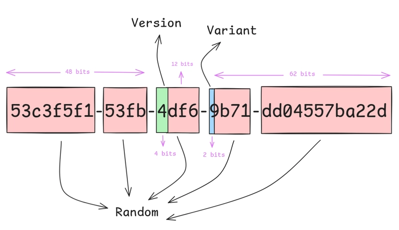
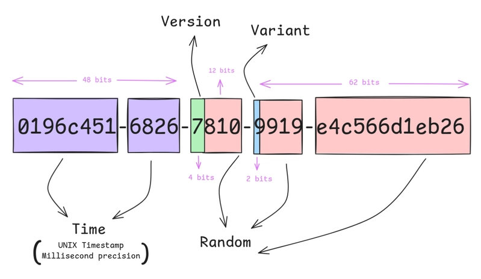

# 太长不看

UUID v4 碰撞了——HackerNews 上有人真的撞了。原因是软件栈的 bug，不是数学。v4 和 v7 在碰撞安全性上没本质区别，差异在索引性能：v7 有时序，B-tree 更紧凑，写入快 35%、索引小 22%。你的 UUID v4 大概率没事，但如果你追求索引性能，换 v7 有实惠。

> 素材来源：[HN UUID v4 碰撞帖](https://news.ycombinator.com/item?id=48060054)、[dev.to UUID Benchmark](https://dev.to/umangsinha12/postgresql-uuid-performance-benchmarking-random-v4-and-time-based-v7-uuids-n9b)


> AI率99%


# UUID v4 碰撞事故

HackerNews 上有个帖子火了——[Ask HN: We just had an actual UUID v4 collision...](https://news.ycombinator.com/item?id=48060054)，479 赞 347 评论。

发帖人的原话：

> I know what you're thinking... and I still can't believe it, but... This morning, our database flagged a duplicate UUID (v4).

不是 double-insert 的 bug，不是代码写了两遍。库里只有 ~15,000 条记录，用 npm 的 `uuid` 包生成 `uuidv4()`，两个不同时间创建的行撞了同一个 UUID：

```
b6133fd6-70fe-4fe3-bed6-8ca8fc9386cd
```

UUID v4 碰撞的概率是多少？122 位随机位，2^122 ≈ 5.3×10^36 种可能，15,000 条记录下碰撞概率约 2×10^-29。理论上"不可能"。

但它发生了。

## 原因一：熵源不可靠

HN 最高赞评论（jandrewrogers）：

> UUIDv4 的安全性依赖高质量熵源。硬件缺陷、软件 bug、对"高质量熵"的误解，都会让这个假设失效。检测熵源故障很贵，所以没人检查——直到撞了。

UUID v4 在高可靠系统中被**明确禁止**，原因是无法验证熵源质量。

## 原因二：npm uuid 包有已知 bug

uuid npm 包的 README 自己都在警告：

> This module may generate duplicate UUIDs when run in clients with deterministic random number generators, such as Googlebot crawlers.

更严重的是，它的 `rng()` 函数内部有全局可变状态。一个评论者指出：调用 `rng()` 然后把结果发出去，等于**覆盖了别人的随机数而且你能猜到它**。

相关 commit：[91805f665c](https://github.com/uuidjs/uuid/commit/91805f665c38b691ac2cbd)

社区建议：用 Node.js 内置的 `crypto.randomUUID()`，别用 npm uuid 包。

## 原因三：Linux 内核 /dev/random 竞态

另一个评论：

> 我在分布式系统的浸泡测试里碰到了 dup UUID。排查很久发现是 Linux 内核的一个竞态 bug——多处理器系统上，两个进程同时读 /dev/random，极低概率（~百万分之一）拿到相同的字节。

## 原因四：Go 的 UUID 库不检查返回值

> 早期 Go UUID 库调用随机数函数时，不检查返回值长度。"请求 N 字节，返回了 3 字节"的情况在大部分硬件上不出现，所以没人检查，直到上生产环境撞了成千上万个重复 UUID。

## 原因五：AMD CPU RNG 的历史缺陷

AMD 某些 CPU 的内置随机数生成器曾经有问题。VM 环境还会"虚拟化掉"熵——虚拟机的时间源和熵源都可能退化。

---

v4 和 v7 在碰撞安全性上没有本质区别，差异在前 48 位——v4 是随机数，v7 是时间戳。时序源出问题的情况你基本碰不到，随机源出问题的概率同样极低。HN 那个帖子是个有趣的特例，知道极少数人遇到了就行，不需要因此怀疑自己系统里的 UUID v4。

选 v4 还是 v7，真正该看的不是碰撞，是**索引性能**。

# UUID v7 在 PG 16 中的性能对比

UUID v7 比 v4 在 PostgreSQL 里有一个实打实的优势：**时序聚簇，B-tree 更友好**。v4 膨胀 v7 也能膨胀，区别只是 v7 的前 48 位有时序，insert 集中在 B-tree 右侧，页分裂少。

[Umang Sinha 的 benchmark](https://dev.to/umangsinha12/postgresql-uuid-performance-benchmarking-random-v4-and-time-based-v7-uuids-n9b) 在 PG 16 Docker 容器（8 核 16GB NVMe）上做了严格的对比测试。

## 测试条件

```sql
CREATE TABLE uuid_v4_test (id UUID PRIMARY KEY, payload TEXT);
CREATE TABLE uuid_v7_test (id UUID PRIMARY KEY, payload TEXT);
```

| 参数 | 值 |
|------|-----|
| 数据量 | 1000 万行/表 |
| 批次 | 每批 1 万行 |
| 客户端 | Go + pq 驱动 |
| UUID 预生成 | 在内存中生成好，不计时 |

## 性能结果

| 指标 | UUID v4 | UUID v7 | 提升 |
|------|---------|---------|------|
| 写入 1000 万行 | 5 分 35 秒 | 3 分 38 秒 | **35% 更快** |
| 表+索引总大小 | 3618 MB | 3443 MB | **5% 更小** |
| B-tree 索引大小 | 776 MB | 602 MB | **22% 更小** |
| 单点查询 | 0.167 ms | 0.038 ms | **4.4 倍** |
| 范围扫描 | 8.283 ms | 3.791 ms | **2.2 倍** |

## 为什么差这么多






UUID v4 是完全随机的。新插入的 UUID 在 B-tree 索引里随机分布，导致大量页分裂（page split），索引碎片化严重。UUID v7 前 48 位是毫秒级时间戳，新生成的 UUID 天然有序——写入集中在 B-tree 的右侧，页分裂大幅减少，索引更紧凑。

索引小 22% 不是魔法，是**减少了碎片**。单点查询快 4 倍也不奇怪——B-tree 层级更少、缓存命中率更高。

# 总结

UUID v4 和 v7 在碰撞安全性上是一样的——都依赖熵源质量，一个用随机数填充前 48 位，一个用时间戳。碰撞是极少数人在特定环境下踩到的坑，你的环境大概率没事，这个基本判断不用变。

真正该琢磨的是**索引性能**。v7 的时序特性让 B-tree 更紧凑，实测写入快 35%、索引小 22%、查询快 2-4 倍。如果系统对 UUID 的写入量很大，换 v7 能省不少存储和 CPU。

PG 18 会原生支持 `gen_uuid_v7()`，目前可以应用层生成。不管用哪个版本，加 UNIQUE 约束总是对的。
